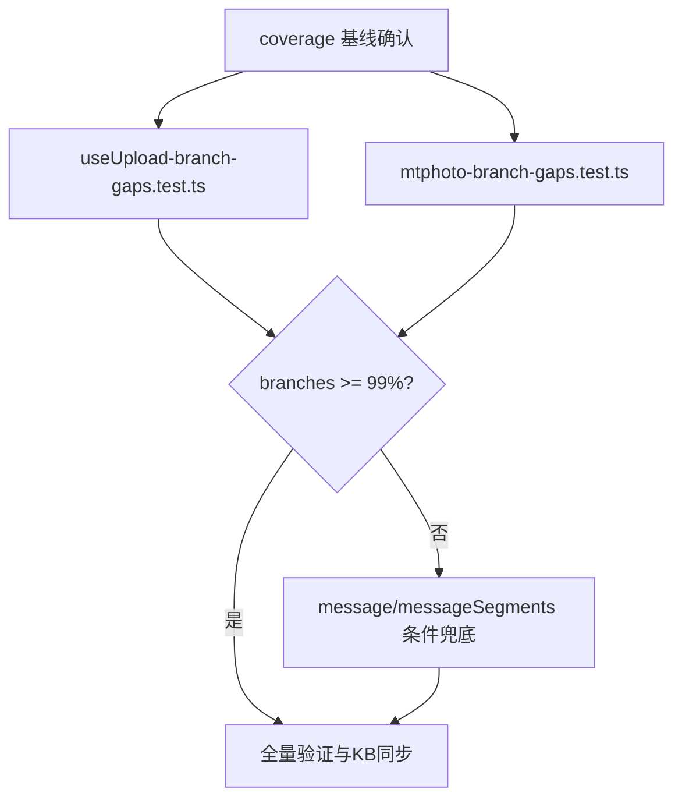

# 变更提案: frontend-test-coverage-gap

## 元信息
```yaml
类型: 测试补强
方案类型: implementation
优先级: P0
状态: 待实施
创建: 2026-03-08
```

---

## 1. 需求

### 背景
当前 `frontend` 侧单测已经达到：
- `npm run test` 通过，现状为 72/72 文件、702/702 用例通过。
- `npx vitest run --coverage` 未通过，阻塞点是全局 `branches=98.66%`，低于 `frontend/vite.config.ts` 中配置的 `branches: 99` 门槛。

已知本轮补测优先级为：
1. `frontend/src/composables/useUpload.ts`
2. `frontend/src/stores/mtphoto.ts`
3. 如前两者补测后仍不足，再补 `frontend/src/stores/message.ts` 或 `frontend/src/utils/messageSegments.ts`

### 目标
- 在**默认不修改生产代码**的前提下，通过补充前端 Vitest 用例，将全局 branch coverage 提升到 `>=99%`。
- 优先以新增/补强测试文件的方式，覆盖 `useUpload.ts` 与 `mtphoto.ts` 的剩余关键分支。
- 保持现有测试套件稳定，确保新增测试不会破坏已有通过结果。
- 若仅靠补测仍不足以达到门槛，明确记录剩余缺口与后续建议，但本轮任务不改生产代码。

### 非目标（本轮不做）
- 不修改 `frontend/src/**` 下的生产实现文件。
- 不下调 `vite.config.ts` 中的 coverage threshold。
- 不调整测试框架、coverage provider 或测试目录结构约束。

### 约束条件
```yaml
代码改动范围: 默认仅修改 frontend/src/__tests__/**/*.test.ts
优先落点:
  - frontend/src/composables/useUpload.ts
  - frontend/src/stores/mtphoto.ts
条件兜底:
  - frontend/src/stores/message.ts
  - frontend/src/utils/messageSegments.ts
验证命令:
  - cd frontend && npm run test
  - cd frontend && npx vitest run --coverage
兼容性: 保持现有 Vitest include 规则与 coverage threshold=99 不变
回滚策略: 测试改动应可独立回退，不影响生产构建与运行逻辑
```

### 验收标准
- [ ] `useUpload.ts` 与 `mtphoto.ts` 的剩余关键分支有明确补测落点，并落实到测试文件。
- [ ] `cd frontend && npm run test` 通过。
- [ ] `cd frontend && npx vitest run --coverage` 通过，且全局 `branches >= 99%`。
- [ ] 若 `useUpload.ts` 与 `mtphoto.ts` 补测后仍未达标，已补充 `message.ts` 或 `messageSegments.ts` 的高价值缺口用例，或至少留下明确缺口说明。
- [ ] 知识库与变更记录同步，能够追溯本次 coverage 补强的范围、验证方式与风险结论。

---

## 2. 方案

### 2.1 总体策略
本方案采用“**测试优先、聚焦补漏、条件兜底**”的 implementation 路径：

1. **先确认缺口，再编写用例**
   - 以当前 coverage 结果为基线，确认 `useUpload.ts` 与 `mtphoto.ts` 仍未覆盖的 branch 区域。
   - 补测目标以“能稳定提升全局分支覆盖率”为准，而不是机械堆叠断言数量。

2. **优先新增聚焦测试文件，而不是继续膨胀超大测试文件**
   - `useUpload.ts` 建议新增独立 coverage 测试文件，例如：
     - `frontend/src/__tests__/useUpload-branch-gaps.test.ts`
   - `mtphoto.ts` 建议新增独立 coverage 测试文件，例如：
     - `frontend/src/__tests__/mtphoto-branch-gaps.test.ts`
   - 如实现过程中判断复用既有文件更合适，也允许扩展现有测试文件，但要保持用例职责清晰、断言可读。

3. **按“主目标 + 条件兜底”推进**
   - 第一阶段：优先补 `useUpload.ts` 与 `mtphoto.ts`
   - 第二阶段：若全局 branches 仍低于 99%，再补 `message.ts` 或 `messageSegments.ts`
   - 这样可以避免过早扩散范围，同时保留达标兜底路径。

### 2.2 分模块补测设计

#### A. `frontend/src/composables/useUpload.ts`
优先覆盖以下分支簇：
- `source` 归一化：`local / douyin / mtphoto / 非法值回退 local`
- douyin 附加字段：`douyinSecUserId / douyinDetailId / douyinAuthorUniqueId / douyinAuthorName` 的“有值追加 / 空值不追加”分支
- 上传成功结果分支：
  - `image / video / file` 三类 media type 推断
  - `posterUrl` 优先
  - `posterLocalPath` 回退并做 `/upload` 前缀归一化
  - `state !== OK` 或 `msg` 缺失返回 `null`
- 错误提示分支：
  - 后端 `error.response.data.error`
  - `localPath` 存在时追加“已保存到本地，可重试”提示
  - `error.message` 回退
  - 默认错误文案回退
- `getMediaUrl()` 的空值、绝对 URL、`/upload/`、`/images/`、`/videos/`、其他路径分支

#### B. `frontend/src/stores/mtphoto.ts`
优先覆盖以下高价值分支簇：
- 收藏夹 / 目录映射保护分支：非数组、空字段、非法数值、默认值回退
- 收藏过滤与展示分支：`any/all`、空 tags、重置过滤器、分组/筛选 fallback
- 目录打开链路：
  - `openFromExternalFolder` 的 `folderId` 快捷路径
  - `folderPath` 标准化 / 逐层解析 / 找不到时回退 root
  - 解析异常时的兜底行为
- timeline 相关分支：阈值 clamp、deferred 加载、错误 fallback
- 目录/收藏 API 错误分支：统一错误提示、状态收敛、分页默认值回退

#### C. 条件兜底：`message.ts` / `messageSegments.ts`
仅在 A+B 完成后全局 branches 仍未达标时启用：
- `message.ts`：优先补历史消息去重、`clientId` 更新、空列表/无命中分支等逻辑型分支
- `messageSegments.ts`：优先补 token 解析、`resolveMediaUrl` 失败回退、preview/meta 组合分支

### 2.3 验证策略
建议采用“两段式验证”：

1. **局部验证**：每完成一个目标测试文件，先跑对应测试文件或相关测试集，快速确认断言稳定。
2. **全量验证**：完成主目标后统一执行：
   - `cd frontend && npm run test`
   - `cd frontend && npx vitest run --coverage`

若 A+B 后 `branches >= 99%`，则跳过兜底模块；若仍未达标，再执行 C 并重新全量验证。

### 2.4 影响范围
```yaml
优先新增测试文件:
  - frontend/src/__tests__/useUpload-branch-gaps.test.ts
  - frontend/src/__tests__/mtphoto-branch-gaps.test.ts
条件新增/调整测试文件:
  - frontend/src/__tests__/message-store-branch-gaps.test.ts
  - frontend/src/__tests__/messageSegments.test.ts
参考生产文件:
  - frontend/src/composables/useUpload.ts
  - frontend/src/stores/mtphoto.ts
  - frontend/src/stores/message.ts
  - frontend/src/utils/messageSegments.ts
知识库同步:
  - .helloagents/modules/media.md
  - .helloagents/modules/mtphoto.md
  - .helloagents/CHANGELOG.md
预计变更文件: 2-5（实施阶段，默认仅测试文件 + 知识库）
```

### 2.5 风险评估
| 风险 | 等级 | 应对 |
|------|------|------|
| `mtphoto.ts` 分支面较大，单次补测可能超出预估 | 高 | 先补最可能影响 branches 的 guard/fallback 分支，并使用独立测试文件控制复杂度 |
| `useUpload.ts` 与 `mtphoto.ts` 补测后全局 branches 仍 <99% | 高 | 启用 `message.ts` / `messageSegments.ts` 条件兜底任务 |
| 现有大型测试文件继续膨胀导致维护性下降 | 中 | 优先新增聚焦 coverage 测试文件，而非继续把用例堆进超长文件 |
| 某些分支仅靠测试难以稳定覆盖 | 中 | 在结论中明确记录“可能需要微调实现或覆盖策略”，但本轮不改生产代码 |
| 新增测试对全量运行时序敏感 | 中 | 采用局部验证 + 全量验证双阶段，必要时隔离 mock 与 timer 状态 |

---

## 3. 技术设计（测试实现侧）

### 测试文件组织


### Mock / 测试边界
- `useUpload.ts`：mock `@/api/media`、`@/stores/media`、`@/stores/systemConfig`、`@/composables/useToast`
- `mtphoto.ts`：mock `@/api/mtphoto`，结合 Pinia store 初始化与必要的 system config 状态
- 仅覆盖逻辑分支，不引入 UI 组件快照或端到端行为

### 数据模型
| 对象 | 关注字段 | 说明 |
|------|----------|------|
| UploadedMedia | `url/type/localFilename/posterUrl` | 用于验证上传成功分支与 poster 回退 |
| MtPhotoFolderFavorite | `folderId/folderPath/tags/note` | 用于验证收藏过滤、打开目录与 fallback 分支 |
| MessageSegment | `kind/path/url/text` | 仅作为条件兜底模块的逻辑断言对象 |

---

## 4. 核心场景

### 场景: useUpload 分支补齐
**模块**: `frontend/src/composables/useUpload.ts`
**条件**: 已建立 mock，且测试允许控制上传 API 返回值与异常对象
**行为**: 覆盖 source 归一化、douyin 附加参数、poster fallback、错误提示、getMediaUrl 分支
**结果**: `useUpload.ts` 的未覆盖 branch 明显收敛，并对未来上传逻辑回归形成保护

### 场景: mtphoto store 分支补齐
**模块**: `frontend/src/stores/mtphoto.ts`
**条件**: 已 mock mtphoto API，能稳定构造 root / folder / favorites / timeline 数据
**行为**: 覆盖目录解析、收藏过滤、timeline defer、错误 fallback 与分页默认值路径
**结果**: `mtphoto.ts` 的剩余 guard / fallback branch 得到覆盖，降低全局 coverage 缺口

### 场景: 条件兜底达标
**模块**: `frontend/src/stores/message.ts` / `frontend/src/utils/messageSegments.ts`
**条件**: `useUpload.ts` 与 `mtphoto.ts` 补测后，coverage 仍低于 99%
**行为**: 选择最小附加成本的逻辑分支进行补测
**结果**: 以最小范围追加测试，使全局 branches 达到门槛

### 场景: 全量验证与记录
**模块**: `frontend` 测试套件 / `.helloagents` 知识库
**条件**: 所有计划中的测试补强已完成或条件跳过
**行为**: 执行全量测试与 coverage，回填知识库与 CHANGELOG
**结果**: 变更可验证、可追溯、可交接

---

## 5. 技术决策

### frontend-test-coverage-gap#D001: 优先新增聚焦 coverage 测试文件，而不是继续扩展超长聚合测试文件
**日期**: 2026-03-08
**状态**: ✅采纳
**背景**: 现有 `stores-more.test.ts`、`composables-more.test.ts` 已较长，继续堆叠 coverage 用例会削弱可维护性与定位效率。
**选项分析**:
| 选项 | 优点 | 缺点 |
|------|------|------|
| A: 继续追加到既有大文件 | 上手快、无需新文件 | 文件继续膨胀，coverage 回归定位困难 |
| B: 新增聚焦 branch-gap 测试文件 | 职责清晰、易维护、易定位 | 会新增少量测试文件 |
**决策**: 选择方案 B
**理由**: 本轮目标是精确补齐分支缺口，独立测试文件更利于表达“覆盖缺口 → 对应断言”的关系。
**影响**: `frontend/src/__tests__/useUpload-branch-gaps.test.ts`、`frontend/src/__tests__/mtphoto-branch-gaps.test.ts`

### frontend-test-coverage-gap#D002: 先做 useUpload + mtphoto 主目标，再按 coverage 结果决定是否补 message / messageSegments
**日期**: 2026-03-08
**状态**: ✅采纳
**背景**: 用户已明确给出优先补测文件，希望先把高概率缺口收敛，再决定是否扩大范围。
**选项分析**:
| 选项 | 优点 | 缺点 |
|------|------|------|
| A: 一次性同时改 4 个模块测试 | 覆盖面大 | 范围扩散快，验证与回归成本高 |
| B: 分层推进（采纳） | 范围可控，便于判断真实缺口来源 | 可能需要第二轮补测 |
**决策**: 选择方案 B
**理由**: 先聚焦最优先模块，只有在 coverage 仍不达标时才扩大到 `message.ts` / `messageSegments.ts`，更符合“最小必要改动”。
**影响**: 任务编排、验证顺序、风险记录方式

### frontend-test-coverage-gap#D003: 本轮坚持测试优先，不主动改生产代码或 coverage 策略
**日期**: 2026-03-08
**状态**: ✅采纳
**背景**: 当前要求明确为“默认只改测试文件，不改生产代码”；但也要预先记录当测试补强仍不足时的后续方向。
**选项分析**:
| 选项 | 优点 | 缺点 |
|------|------|------|
| A: 允许顺手修改实现辅助覆盖 | 可能更快达标 | 超出本轮边界，易引入功能风险 |
| B: 坚持仅补测试（采纳） | 范围清晰、风险最低 | 少数难覆盖分支可能只能记录后续建议 |
**决策**: 选择方案 B
**理由**: 先用测试补强解决问题；若仍存在不可覆盖或成本过高分支，再在结论中记录“可能需要微调实现或覆盖策略”的下一步。
**影响**: 本轮实施边界、风险结论、知识库同步内容
