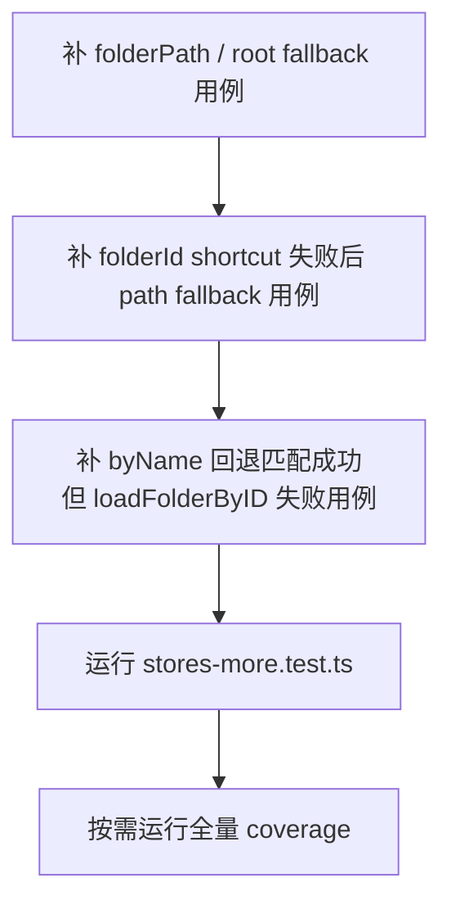

# 变更提案: mtphoto-test-gap

## 元信息
```yaml
类型: 测试增强
方案类型: implementation
优先级: P2
状态: 实施中
创建: 2026-03-08
关联会话: 当前会话（继续补 mtphoto 测试分支）
```

---

## 1. 需求

### 背景
上一轮已通过补充 `useUpload` 测试恢复前端 coverage 门禁，但 `frontend/src/stores/mtphoto.ts` 仍存在一组高价值分支缺口，主要集中在：
- `resolveFolderNodeByPath()`
- `openFromExternalFolder()`

这些缺口集中在“外部目录打开 / 路径解析 / 失败回退到根目录”链路，属于用户可见行为，继续补齐可以提高 mtphoto 模块回归保护强度。

### 目标
- 为 `mtphoto.ts` 的外部目录打开与路径回退链路补充最小增量测试。
- 仅修改测试文件，不调整生产代码。
- 在保持现有全量测试通过的前提下，提升 `mtphoto.ts` 的分支覆盖率与回归可信度。

### 非目标（本轮不做）
- 不为疑似不可达分支强行编写脆弱测试。
- 不重构 `mtphoto.ts` 生产实现。
- 不触碰与本轮目标无关的其他 store / 组件测试。

### 约束条件
```yaml
修改范围: 优先仅修改 frontend/src/__tests__/stores-more.test.ts
验证命令: cd frontend && npx vitest run src/__tests__/stores-more.test.ts；必要时再跑全量 coverage
策略: 只覆盖明确可达且具备业务价值的路径解析与回退分支
```

### 验收标准
- [ ] `stores-more.test.ts` 新增覆盖 `openFromExternalFolder()` / `resolveFolderNodeByPath()` 的高价值回退测试。
- [ ] `cd frontend && npx vitest run src/__tests__/stores-more.test.ts` 通过。
- [ ] 如执行全量 coverage，整体结果不回退，且 `mtphoto.ts` 的分支覆盖率较当前提升。

---

## 2. 方案

### 技术方案
采用“围绕现有测试块做最小插入”的方式补测，优先增加以下场景：
1. `folderPath='/'` 时，路径解析应直接短路并 fallback 到根目录。
2. `folderId shortcut` 打开失败后，继续按 `folderPath` 尝试解析，并在中间层目录列表异常时回退根目录。
3. 根目录返回非数组 `folderList` 时，路径解析直接失败并回退根目录。
4. `byPath` 失配后按 `name` 回退匹配成功，但真正打开 resolved folder 失败时仍能回退根目录。

### 影响范围
```yaml
涉及模块:
  - mtphoto: 外部目录打开与路径解析失败回退测试增强
预计变更文件: 1 个测试文件 + 方案包/知识库记录
```

### 风险评估
| 风险 | 等级 | 应对 |
|------|------|------|
| mock 调用顺序复杂，容易写成与实现强耦合的测试 | 中 | 只断言关键调用与最终用户可见状态 |
| 个别剩余分支可能不可达 | 中 | 只补可达分支；对不可达分支在完成报告中说明 |
| 全量 coverage 统计波动 | 低 | 先跑目标测试，再视需要跑全量 coverage 核验 |

---

## 3. 技术设计（可选）

### 测试策略


---

## 4. 核心场景

### 场景: 目录路径无法解析时回退根目录
**模块**: mtphoto
**条件**: 外部调用 `openFromExternalFolder()`，传入的路径不可解析或中间接口返回异常结构
**行为**: store 尝试按现有路径解析逻辑查找目录节点，失败后调用 `loadFolderRoot()`
**结果**: 当前目录状态回到“根目录”，不会残留半初始化状态

### 场景: folderId shortcut 失败后继续走 path fallback
**模块**: mtphoto
**条件**: 外部同时传入 `folderId` 和 `folderPath`，但 `folderId` 直接打开失败
**行为**: store 不直接终止，而是继续尝试通过 `folderPath` 解析目标目录
**结果**: 若 path 解析也失败，则最终统一回退到根目录

---

## 5. 技术决策

### mtphoto-test-gap#D001: 继续只补测试，不改实现
**日期**: 2026-03-08
**状态**: ✅采纳
**背景**: 当前 `mtphoto.ts` 仍有少量回退链路分支缺口，但生产行为本身未发现缺陷。
**选项分析**:
| 选项 | 优点 | 缺点 |
|------|------|------|
| A: 补测试（推荐） | 风险最小，继续提升回归保护 | 不能消除疑似不可达分支 |
| B: 改实现以追求更高覆盖率 | 可能提升覆盖率数字 | 会引入额外行为变化与 review 成本 |
**决策**: 选择方案 A
**理由**: 本轮目标是增强回归测试而非修改业务实现；仅补可达高价值分支更符合当前需求。
**影响**: 本轮主要影响 `frontend/src/__tests__/stores-more.test.ts`。
