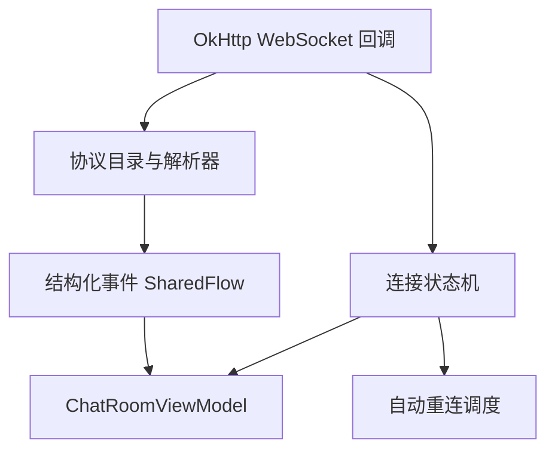

# 技术设计: Android WebSocket 协议与重连修复

## 技术方案
### 核心技术
- Kotlin + OkHttp WebSocket
- Kotlinx Serialization JSON
- Kotlin Coroutines `CoroutineScope` + `delay`

### 实现要点
- 在 `LiaoWebSocketClient` 内定义最小协议目录，统一维护已知 `code` / `act` 常量与解析入口
- 为入站消息建立结构化事件模型，区分私信、通知、forceout 与未知消息
- 通过内部协程调度真实重连，并用连接序号忽略过期 socket 回调
- 在 `ChatRoomFeature` 中消费结构化事件，维持现有最小聊天 UI 骨架

## 架构设计

## 安全与性能
- **安全:** 仅处理现有后端定义的 `/ws` 消息，不引入新的敏感信息持久化；forceout 后显式停止自动重连
- **性能:** 解析仅在收到消息时执行；重连采用有限退避，避免异常断线时高速重试

## 测试与部署
- **测试:** 增补 `ProtocolAlignmentTest`，验证协议目录能识别 forceout / reject / 私信消息，并保持 5 分钟 forceout 常量
- **部署:** 无额外部署步骤，Android 端重新同步工程并执行本地 Gradle 测试即可
