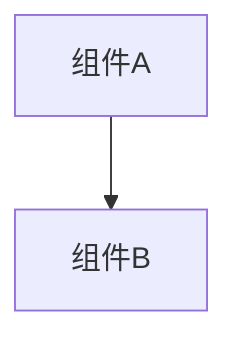

# 变更提案: tests-boundary-cases

## 元信息
```yaml
类型: 优化
方案类型: implementation
优先级: P2
状态: 已完成
创建: 2026-01-22
```

---

## 1. 需求

### 背景
项目已有较完善的前后端测试，但部分“边界/异常路径”仍缺少覆盖（尤其是身份管理、收藏删除、抖音下载头解析、上传 URL 文件名解析、以及前端消息分段解析的异常输入）。
本次按用户要求进行代码审查后，补齐这些边界用例以提升回归可靠性。

### 目标
- 补齐后端（Go）关键 handler 与解析函数的边界/异常测试用例。
- 补齐前端（Vue/Vitest）消息分段解析的边界用例，避免异常输入导致 UI 解析出错或回退不一致。
- 保持测试可重复：避免真实网络/真实 DB 依赖（使用 sqlmock/纯函数测试）。

### 约束条件
```yaml
时间约束: 无
性能约束: 测试应保持快速（避免长时间等待/真实网络）
兼容性约束: 不修改线上行为，仅补测试
业务约束: 以现有实现为准（测试锁定当前错误处理/回退语义）
```

### 验收标准
- [x] `go test ./...` 通过
- [x] `cd frontend && npm test` 通过
- [x] `cd frontend && npm run build` 通过

---

## 2. 方案

### 技术方案
- 后端：
  - 对 handler 进行表单参数边界测试（缺失/非法/不存在/DB 错误），使用 `sqlmock` 精准模拟查询与事务行为。
  - 对纯解析函数（Content-Range total、URL 文件名提取）添加 table-driven 测试覆盖非法输入与极值。
- 前端：
  - 在 `messageSegments` 相关测试中补齐异常输入（括号不闭合、非法 token、解析回退、预览生成兜底等）。
- 使用 `gemini` 生成待补边界点清单，结合实际代码实现筛选落地。

### 影响范围
```yaml
涉及模块:
  - Identity: handler 边界与事务失败路径
  - Favorite: 删除接口边界与错误忽略语义
  - Douyin downloader: Content-Range total 解析
  - Media upload: URL 文件名解析
  - Chat UI: 消息分段解析与 lastMsg 预览兜底
预计变更文件: 5（均为测试文件）
```

### 风险评估
| 风险 | 等级 | 应对 |
|------|------|------|
| 测试锁定当前回退语义（如删除接口忽略错误） | 低 | 仅补测试，不改变行为；未来若调整行为，同步更新测试 |
| 事务/时间相关断言不稳定 | 低 | 对时间字段使用 `sqlmock.AnyArg()`，避免依赖当前时间字符串 |

---

## 3. 技术设计（可选）

> 涉及架构变更、API设计、数据模型变更时填写

### 架构设计


### API设计
#### {METHOD} {路径}
- **请求**: {结构}
- **响应**: {结构}

### 数据模型
| 字段 | 类型 | 说明 |
|------|------|------|
| {字段} | {类型} | {说明} |

---

## 4. 核心场景

> 执行完成后同步到对应模块文档

### 场景: identity handler 边界与事务失败
**模块**: Identity
**条件**: 参数缺失/新 ID 已存在/事务插入失败等
**行为**: handler 返回 400/500 并保持 DB 期望行为（sqlmock 验证执行顺序）
**结果**: 返回码/消息符合当前实现；事务失败路径可回退

### 场景: messageSegments 异常输入兜底
**模块**: Chat UI
**条件**: `[` 不闭合、token 含空白或 `://`、resolveMediaUrl 失败等
**行为**: 保持文本回退，不产生错误媒体节点；预览生成有兜底
**结果**: 解析结果稳定且符合预期

---

## 5. 技术决策

> 本方案涉及的技术决策，归档后成为决策的唯一完整记录

### tests-boundary-cases#D001: 边界测试以“纯函数 + handler 参数校验/错误分支”为主，避免集成依赖
**日期**: 2026-01-22
**状态**: ✅采纳
**背景**: 需要快速补齐关键边界覆盖，同时保持测试稳定可重复。
**选项分析**:
| 选项 | 优点 | 缺点 |
|------|------|------|
| A: handler + 解析函数单测（sqlmock/纯函数） | 快、稳定、定位清晰 | 覆盖不到真实集成问题 |
| B: 启动服务做端到端测试 | 覆盖更接近线上 | 成本高、易受环境影响 |
**决策**: 选择方案 A
**理由**: 本次目标是补齐边界回归用例，不引入环境依赖与复杂 harness。
**影响**: 后端与前端测试文件新增用例，不影响运行时代码
