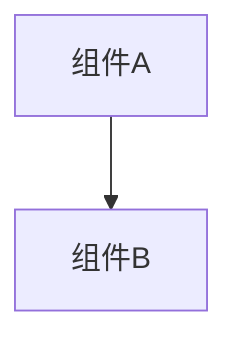

# 变更提案: fix_favorite_removebyid_invalid_id

## 元信息
```yaml
类型: 修复
方案类型: implementation
优先级: P2
状态: 已完成
创建: 2026-01-22
```

---

## 1. 需求

### 背景
`POST /api/favorite/removeById` 之前对 `id` 参数解析失败会静默按 `0` 执行删除并返回 success，容易掩盖调用端 bug（或导致误操作）。
需要将“id 解析失败”明确返回客户端错误。

### 目标
- 当 `id` 为空或解析失败（含 `<=0`）时，接口返回 HTTP 400 且给出明确错误消息。
- 其余行为保持不变：删除 DB 错误仍忽略并返回 success；`/api/selectIdentity` 刷新 `last_used_at` 失败仍保持忽略（按用户要求）。

### 约束条件
```yaml
时间约束: 无
性能约束: 无
兼容性约束: 仅收紧无效参数（客户端需传入合法 id）
业务约束: 不改变 delete 失败忽略策略；不改变 selectIdentity 的 last_used_at 忽略策略
```

### 验收标准
- [x] `go test ./...` 通过
- [x] `helloagents/wiki/api.md` 已同步接口错误语义

---

## 2. 方案

### 技术方案
- `internal/app/favorite_handlers.go`：
  - `id` 为空：HTTP 400，`{"code":-1,"msg":"id不能为空"}`
  - `id` 解析失败或 `<=0`：HTTP 400，`{"code":-1,"msg":"id无效"}`
- 更新对应测试用例，避免“解析失败默认为 0”的旧语义回归。
- 更新 API 文档与 CHANGELOG。

### 影响范围
```yaml
涉及模块:
  - Favorite: removeById 参数校验
预计变更文件: 4+
```

### 风险评估
| 风险 | 等级 | 应对 |
|------|------|------|
| 客户端传入非法 id 时不再返回 success | 低 | 前端接口签名已使用 number；新增测试锁定行为 |

---

## 3. 技术设计（可选）

> 涉及架构变更、API设计、数据模型变更时填写

### 架构设计


### API设计
#### {METHOD} {路径}
- **请求**: {结构}
- **响应**: {结构}

### 数据模型
| 字段 | 类型 | 说明 |
|------|------|------|
| {字段} | {类型} | {说明} |

---

## 4. 核心场景

> 执行完成后同步到对应模块文档

### 场景: removeById 参数无效
**模块**: Favorite
**条件**: `id` 为空/非数字/`<=0`
**行为**: 直接返回 HTTP 400，不触发删除
**结果**: 返回 `{code:-1,msg:"id不能为空"|"id无效"}`

---

## 5. 技术决策

> 本方案涉及的技术决策，归档后成为决策的唯一完整记录

### fix-favorite-removebyid-invalid-id#D001: removeById 对非法 id 直接返回 400
**日期**: 2026-01-22
**状态**: ✅采纳
**背景**: 将调用端错误显式暴露，避免“silent success”掩盖问题或触发误删。
**选项分析**:
| 选项 | 优点 | 缺点 |
|------|------|------|
| A: 解析失败按 0 继续（旧行为） | 兼容松散输入 | 掩盖 bug/潜在误删 |
| B: 解析失败返回 400（新行为） | 行为明确、易排查 | 客户端需修正非法参数 |
**决策**: 选择方案 B
**理由**: 与“参数校验失败应明确失败”的整体接口约定一致。
**影响**: Favorite removeById 调用方在传参非法时会收到 400
