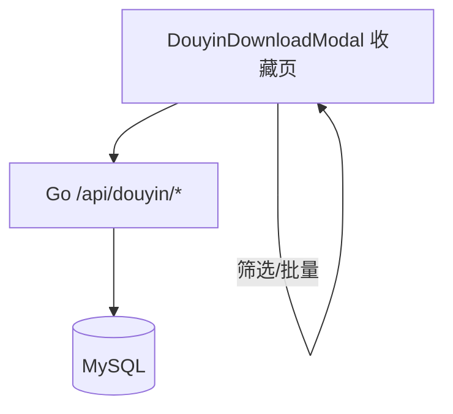

# 变更提案: douyin-favorite-tags

## 元信息
```yaml
类型: 新功能
方案类型: implementation
优先级: P1
状态: 已完成
创建: 2026-01-24
```

---

## 1. 需求

### 背景
现有“抖音下载 → 收藏”仅支持收藏抖音用户与作品，并在列表中查看/取消收藏与一键再次解析。
当收藏数量增多后，缺少分类能力会导致查找、筛选与管理成本明显上升。

### 目标
- 为“抖音用户收藏 / 抖音作品收藏”分别增加“分类标签”，用于按标签筛选。
- 支持对已存在收藏条目编辑/删除其标签（多标签）。
- 支持批量打标签（移动端优先交互）。
- 提供独立的标签管理页：新建/重命名/删除标签。

### 约束条件
```yaml
时间约束: 无
性能约束: 收藏列表可达到较大数量，前端筛选应保持流畅（本次实现以内存过滤为主）
兼容性约束: 对既有收藏数据无破坏性变更；历史收藏默认“未分类”
业务约束:
  - 每条收藏可绑定多个标签
  - 标签仅名称（暂不做颜色/图标）
  - 标签全局共享（不按本地身份隔离）
  - 删除标签后：从所有绑定条目移除，该条目变为未分类（无标签）
  - 用户收藏标签与作品收藏标签两套体系互不影响
```

### 验收标准
- [ ] 收藏列表展示每条收藏的标签（无标签显示“未分类”）
- [ ] 支持按标签筛选（含“全部/未分类/具体标签”）
- [ ] 支持单条编辑标签（可多选；可清空为未分类）
- [ ] 支持批量打标签（向多条收藏“添加标签”，不移除已有标签）
- [ ] 标签管理页可新建/重命名/删除标签；删除需二次确认并展示影响数量
- [ ] 后端提供完整标签 CRUD + 绑定接口；收藏列表返回 `tagIds`
- [ ] Go 单测与前端 build/test 通过

---

## 2. 方案

### 技术方案
后端：
- 新增 4 张 MySQL 表：两类标签表 + 两类映射表（用户/作品各一套），标签名在各自范围内唯一。
- 收藏列表接口元素新增 `tagIds: number[]`，后端在 list/find 时补齐。
- 新增标签管理接口：list/add/update/remove；新增标签绑定接口：apply（支持 set/add/remove 三种 mode，前端当前使用 set/add）。

前端（移动端优先）：
- 收藏页顶部增加标签筛选栏：全部/未分类/标签 chips + 进入“管理标签”按钮。
- 收藏条目卡片展示标签 chips（最多展示 2 个 +N）。
- 批量模式：选择多条条目后点击“打标签”打开底部抽屉，选择要添加的标签。
- 单条编辑：用户收藏在详情抽屉内“编辑标签”；作品收藏在列表卡片按钮“标签”进入编辑抽屉。
- 标签管理页（全屏覆盖层）支持新建/重命名/删除与二次确认。

### 影响范围
```yaml
涉及模块:
  - 后端: DouyinFavorite（表结构/Service/Handlers/Router）
  - 前端: 抖音下载弹窗（收藏模式 UI + API）
  - 知识库: API/Data/模块文档与 CHANGELOG
预计变更文件: 10+
```

### 风险评估
| 风险 | 等级 | 应对 |
|------|------|------|
| 标签表/映射表增量引入导致 schema/test 不一致 | 低 | 同步更新 `internal/app/schema.go`、`sql/init.sql` 与 `schema_test.go` |
| 收藏列表补齐 tagIds 导致额外 SQL 查询 | 低 | 映射表按需查询；列表场景使用全表映射拉取并在内存分组 |
| 前端弹窗文件已很大，继续膨胀影响维护 | 中 | 仅在收藏区域增量实现；后续可再拆分为子组件（未在本次强行重构） |

---

## 3. 技术设计（可选）

> 涉及架构变更、API设计、数据模型变更时填写

### 架构设计（简化）


### API设计
#### [GET] /api/douyin/favoriteUser/tag/list
- **响应**: `{"items":[{id,name,count,createTime,updateTime}]}`

#### [POST] /api/douyin/favoriteUser/tag/add
- **请求**: `{"name":"美食"}`
- **响应**: `{id,name,count,createTime,updateTime}`

#### [POST] /api/douyin/favoriteUser/tag/update
- **请求**: `{"id":1,"name":"教程"}`
- **响应**: `{id,name,count,createTime,updateTime}`

#### [POST] /api/douyin/favoriteUser/tag/remove
- **请求**: `{"id":1}`
- **响应**: `{"success":true}`

#### [POST] /api/douyin/favoriteUser/tag/apply
- **请求**: `{"secUserIds":["MS4w..."],"tagIds":[1,2],"mode":"set|add|remove"}`
- **响应**: `{"success":true}`

（作品收藏同结构：路径将 `favoriteUser` 替换为 `favoriteAweme`，字段将 `secUserIds` 替换为 `awemeIds`）

### 数据模型
#### `douyin_favorite_user_tag`
| 字段 | 类型 | 说明 |
|------|------|------|
| id | BIGINT | 自增主键 |
| name | VARCHAR(64) | 标签名（唯一） |
| created_at | DATETIME | 创建时间 |
| updated_at | DATETIME | 更新时间 |

#### `douyin_favorite_user_tag_map`
| 字段 | 类型 | 说明 |
|------|------|------|
| sec_user_id | VARCHAR(128) | 收藏用户ID |
| tag_id | BIGINT | 标签ID |
| created_at | DATETIME | 创建时间 |

（作品标签/映射表同理：`douyin_favorite_aweme_tag(_map)`）

---

## 4. 核心场景

> 执行完成后同步到对应模块文档

### 场景: 收藏按标签筛选
**模块**: Douyin Downloader（收藏）
**条件**: 已有收藏条目与若干标签
**行为**: 选择“全部/未分类/某标签”
**结果**: 列表仅显示匹配条目；无匹配时提示“暂无匹配结果”

### 场景: 单条编辑标签
**模块**: Douyin Downloader（收藏）
**条件**: 进入用户收藏详情或点击作品收藏“标签”
**行为**: 多选标签并保存（可清空）
**结果**: 后端更新映射；条目 `tagIds` 更新；清空后显示“未分类”

### 场景: 批量打标签
**模块**: Douyin Downloader（收藏）
**条件**: 进入批量模式并选择多个条目
**行为**: 打开底部抽屉选择标签并“添加”
**结果**: 所选标签添加到所有选中条目；不移除原有标签

### 场景: 标签管理（删除）
**模块**: Douyin Downloader（收藏）
**条件**: 打开标签管理页
**行为**: 删除标签 → 二次确认
**结果**: 标签从所有条目移除；条目保留并变为未分类

---

## 5. 技术决策

> 本方案涉及的技术决策，归档后成为决策的唯一完整记录

### douyin-favorite-tags#D001: 标签表设计（分表 vs 单表）
**日期**: 2026-01-24
**状态**: ✅采纳
**背景**: 需要同时支持“用户收藏标签 / 作品收藏标签”两套互不影响的标签体系。
**选项分析**:
| 选项 | 优点 | 缺点 |
|------|------|------|
| A: 单表（tag_type + target_id） | 表更少、可复用逻辑 | 需要额外 type 字段与更复杂查询；难以做外键约束；可读性下降 |
| B: 分表（用户/作品各自标签表 + 映射表） | 结构清晰、查询简单、与业务“互不影响”一致 | 表数量增加、逻辑略有重复 |
**决策**: 选择方案 B
**理由**: 优先保证可维护性与语义清晰，避免引入复杂的“多态关联”。
**影响**: 后端 schema/Service/Handlers；前端接口分组与 UI 在 tab 下自然隔离
