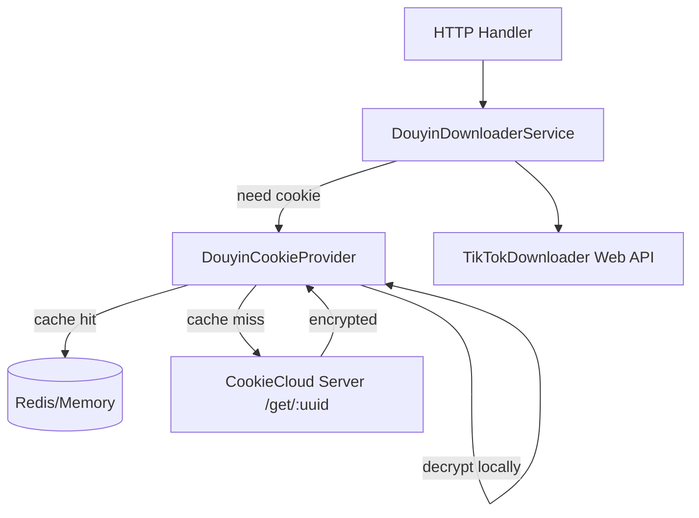

# 变更提案: douyin-cookiecloud-cookie

## 元信息
```yaml
类型: 新功能
方案类型: implementation
优先级: P1
状态: 已实现
创建: 2026-02-01
```

---

## 1. 需求

### 背景
当前抖音相关能力通过 TikTokDownloader Web API（上游 FastAPI）实现，部分接口在没有 Cookie 的情况下会出现：
- 可解析/可抓取成功率不稳定
- 返回内容不完整或被风控拦截

目前 Cookie 主要依赖前端弹窗里手动填写（localStorage 保存）或通过 `DOUYIN_COOKIE` 环境变量设置默认值。
为了降低人工维护成本，希望服务端能在需要时自动从 CookieCloud 拉取并解密抖音 Cookie，并在一定时间内复用缓存。

### 目标
- 在调用上游抖音接口（TikTokDownloader `/douyin/*`）时，当请求未显式传入 `cookie`，服务端自动携带从 CookieCloud 获取的抖音 Cookie。
- “懒加载”：服务启动后不主动拉取 Cookie；第一次发生抖音上游请求时才拉取（并解密）。
- 缓存：
  - 当 `CACHE_TYPE=redis`：将 Cookie 缓存写入 Redis，并设置过期时间。
  - 当未使用 Redis：将 Cookie 缓存保存在内存中（进程内）。
- 缓存过期时间默认 72 小时（3 天），并支持通过环境变量以“小时”为单位配置。

### 约束条件
```yaml
时间约束: 无
性能约束: 不应在每次抖音请求都访问 CookieCloud；应优先命中缓存
兼容性约束: 仍保留“前端显式传 cookie”优先级；CookieCloud 未配置时保持现有行为
业务约束: Cookie 属于敏感信息，不落库；仅允许内存/Redis 缓存（带 TTL），并避免日志泄露
```

### 验收标准
- [ ] 当未传 `cookie` 且已配置 CookieCloud：抖音上游请求能携带从 CookieCloud 解密得到的 Cookie（以单测/集成测试证明）。
- [ ] 第一次抖音请求会触发 CookieCloud 拉取；同一进程内后续请求在 TTL 内不重复拉取（命中缓存）。
- [ ] `CACHE_TYPE=redis` 时，Cookie 会写入 Redis 且带 TTL；重启服务后仍可复用缓存直到过期。
- [ ] TTL 默认 72 小时；可通过环境变量配置（单位小时），并有基础校验（<=0 回退默认或启动时报错，二选一）。
- [ ] `go test ./...` 通过。

---

## 2. 方案

### 技术方案
总体思路：引入一个“抖音 Cookie 提供器（provider）”，在真正发起上游抖音请求前获取“有效 Cookie”：

1) **优先级**（从高到低）  
- 请求参数显式传入的 `cookie`（保持现有行为）
- CookieCloud provider 返回的 Cookie（本需求新增）
- `DOUYIN_COOKIE` 环境变量（现有默认值）

2) **懒加载 + 缓存**  
- provider 在第一次被调用时，先查缓存（内存/Redis），未命中才访问 CookieCloud `/get/:uuid` 拉取密文并在本地解密。
- provider 将“Cookie header value（形如 `a=1; b=2`）”写入缓存，并设置 TTL。

3) **Redis vs 内存**  
- 当 `CACHE_TYPE=redis`：复用应用已有的 Redis 连接配置，使用 Redis `GET/SETEX` 存储 Cookie 字符串。
- 否则：进程内缓存（可用现有 `lruCache` 实现 1 条记录 + TTL）。

### 影响范围
```yaml
涉及模块:
  - douyin-downloader: 上游请求组装 cookie 的默认策略变更（引入 CookieCloud provider）
  - config: 新增/扩展 CookieCloud 与 Cookie TTL 的环境变量配置
  - knowledge-base: 补充配置说明与安全约束
预计变更文件: 6-10
```

### 风险评估
| 风险 | 等级 | 应对 |
|------|------|------|
| Redis 中缓存 Cookie 属于敏感数据 | 中 | 仅写入 Cookie header value + TTL；不落库；文档明确安全风险；建议仅在私有 Redis/内网使用 |
| CookieCloud 拉取失败导致抖音能力不可用 | 中 | provider 失败时的策略需明确（建议：返回错误并提示配置/网络问题；也可选择降级到默认 cookie） |
| Cookie 域名不匹配导致取不到目标 cookie | 低 | 通过 `COOKIECLOUD_DOMAIN` 显式配置；provider 内部做 `.domain`/`domain` 兜底匹配 |

---

## 3. 技术设计（可选）

> 涉及架构变更、API设计、数据模型变更时填写

### 架构设计


### API设计
无需新增对外 API；变更仅影响服务端到上游的调用行为。

### 数据模型
| 字段 | 类型 | 说明 |
|------|------|------|
| cachedCookie | string | 缓存的 Cookie header value（例如 `a=1; b=2`） |
| ttl | duration | 缓存有效期（默认 72h，可配置） |

---

## 4. 核心场景

> 执行完成后同步到对应模块文档

### 场景: 首次抖音请求自动拉取 Cookie
**模块**: douyin-downloader
**条件**:
- `TIKTOKDOWNLOADER_BASE_URL` 已配置（抖音能力已启用）
- `COOKIECLOUD_BASE_URL/COOKIECLOUD_UUID/COOKIECLOUD_PASSWORD/COOKIECLOUD_DOMAIN` 已配置
**行为**:
- 用户调用任一抖音相关 API（例如 `/api/douyin/detail`）且未显式传 `cookie`
- 服务端通过 CookieCloud provider 拉取并解密 cookie，注入到上游请求 payload 的 `cookie` 字段
**结果**:
- 上游请求携带 cookie；返回成功率提升；cookie 被写入缓存并带 TTL

### 场景: TTL 内命中缓存
**模块**: douyin-downloader
**条件**: 上次已成功拉取 cookie 且未过期
**行为**: 再次请求抖音相关 API（未显式传 `cookie`）
**结果**: 直接从 Redis/内存缓存读取 cookie，不访问 CookieCloud

---

## 5. 技术决策

> 本方案涉及的技术决策，归档后成为决策的唯一完整记录

### douyin-cookiecloud-cookie#D001: Cookie 注入位置选择（payload vs HTTP Header）
**日期**: 2026-02-01
**状态**: ✅采纳
**背景**: 当前上游 TikTokDownloader Web API 的请求模型在 JSON body 中使用 `cookie` 字段；服务端应在同一位置注入，避免改动上游 client 的 HTTP header 处理逻辑。
**选项分析**:
| 选项 | 优点 | 缺点 |
|------|------|------|
| A: 注入到 TikTokDownloader JSON payload 的 `cookie` 字段 | 与现有实现一致；改动最小 | 仅适用于该上游接口模型 |
| B: 注入到 HTTP Header `Cookie` | 通用；更贴近 HTTP 语义 | 需要调整 TikTokDownloader client；且上游未必读取该 header |
**决策**: 选择方案 A
**理由**: 最小改动 + 与现有 upstream 模型一致，风险最低。
**影响**: `internal/app/douyin_downloader.go` 的 cookie 默认策略将引入 provider。
