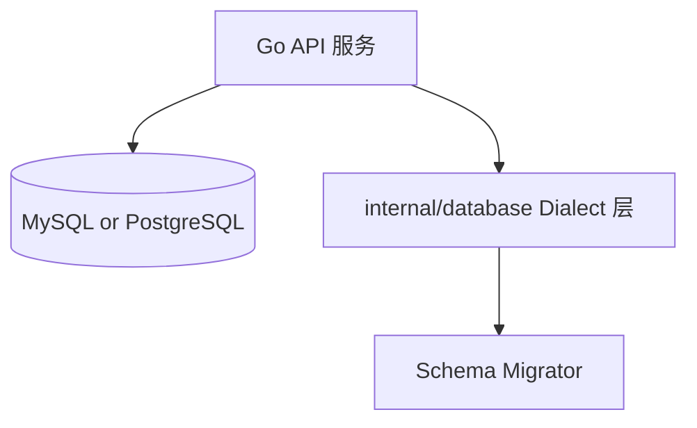

# 变更提案: db-dualstack-mysql-postgres

## 元信息
```yaml
类型: 重构
方案类型: implementation
优先级: P0
状态: 已完成
创建: 2026-02-01
```

---

## 1. 需求

### 背景
当前后端存储实现强绑定 MySQL（driver、连接串解析、DDL/DML 方言、占位符、`LastInsertId` 等）。
用户要求迁移后仍同时支持 MySQL + PostgreSQL（双栈），并且可在运行时通过配置切换，切换后业务行为不受影响。

为避免业务代码里到处出现 `if dbType == ...`，需要引入一个轻量级“方言抽象层”，将差异集中在少量模块内。

### 目标
- 在不改动对外 HTTP API 的前提下，让服务同时支持 MySQL 与 PostgreSQL。
- 运行时仅通过配置切换数据库类型（例如改 `DB_URL` scheme / 显式 `DB_DIALECT`），无需改代码。
- 两种数据库在核心行为上保持一致（schema 约束、排序、时区、大小写/模糊查询策略等）。
- 增强测试：同一套业务测试可以在两种方言下运行，并在 CI/本地支持双数据库冒烟或集成测试。

### 约束条件
```yaml
时间约束: 无硬性，但建议分阶段交付（先抽象层+连通，再逐模块迁移 SQL）
性能约束: 不能引入重型 ORM；保持 database/sql 模式；额外封装需低开销
兼容性约束: 双栈必须长期可维护（SQL 方言差异需集中封装，而非散落业务层）
业务约束: 若已有线上 MySQL 数据，需要提供 MySQL→PostgreSQL 的数据迁移与校验 runbook；并提供回滚/切换预案
```

### 验收标准
- [ ] `DB_URL` 仅通过 URL scheme 决定数据库类型：支持 `mysql://`/`jdbc:mysql://` 与 `postgres://`/`postgresql://`/`jdbc:postgresql://`
- [ ] 在 MySQL 与 PostgreSQL 上均可“空库冷启动”：服务启动可自动建表/迁移成功，核心 API 可用
- [ ] 业务 SQL 统一使用 `?` 占位符写法，并在执行前由 Dialect `Rebind` 转换（PG → `$1,$2...`）
- [ ] `INSERT IGNORE` / `ON DUPLICATE KEY UPDATE` / `RETURNING` 等差异通过集中封装解决（业务层不写分支）
- [ ] `go test ./...` 通过，并新增/调整集成测试：同一套测试可分别在 MySQL/PG 下执行通过
- [ ] README/CLAUDE/知识库中数据库描述、env 示例与代码保持一致（SSOT）

---

## 2. 方案

### 技术方案
核心思路：**引入 Dialect 抽象层 + 统一占位符 + 方言化 Upsert/迁移**，保持 `database/sql` 使用方式不变。

1) **新增数据库基础设施包（推荐放在 `internal/database/`）**
- `Dialect`：封装差异点（占位符、Rebind、Upsert/InsertIgnore 生成、是否支持 RETURNING、错误码判断等）
- `DB`/`Querier`：对外暴露 `*sql.DB` 的最小封装（统一在 Query/Exec 前调用 Rebind）
- `Migrator`：负责执行 schema 初始化/迁移（按方言选择对应 DDL）

2) **占位符统一策略（减少迁移成本）**
- 业务 SQL 统一仍写 `?`（与现有代码一致）
- MySQL Dialect：Rebind 为原样
- PostgreSQL Dialect：Rebind 将 `?` 依次替换为 `$1,$2...`
- 动态 IN：封装 `ExpandIn("... IN (?)", []any{...})`，先扩展为多个 `?`，再 Rebind

3) **DB 选择策略（仅 DB_URL scheme）**
- 不新增 `DB_DIALECT`；数据库类型严格由 `DB_URL` 的 scheme 决定
  - 支持：`mysql`、`postgres`、`postgresql`
  - 兼容：`jdbc:` 前缀（如 `jdbc:mysql://...`、`jdbc:postgresql://...`）
  - 其他 scheme：直接报错（避免“误连错库”）

3) **Upsert / InsertIgnore / ReturningId 的统一封装**
- `InsertIgnore`：
  - MySQL: `INSERT IGNORE INTO ...`
  - PG: `INSERT INTO ... ON CONFLICT (...) DO NOTHING`
- `Upsert`：
  - MySQL: `INSERT ... ON DUPLICATE KEY UPDATE ...`
  - PG: `INSERT ... ON CONFLICT (conflict_cols) DO UPDATE SET ...`（使用 `EXCLUDED`）
- “插入返回 id”：
  - MySQL: `Exec` + `LastInsertId`
  - PG: `QueryRow` + `RETURNING id`
  - 业务层调用统一的 `InsertReturningID(ctx, ...)`（由 Dialect 决定实现）

4) **Schema/迁移双栈策略（推荐两套 DDL）**
DDL 方言差异过大（ENGINE/charset/类型/索引/注释），不建议自动转换。
维护两套 schema SQL（或两套 Go DDL 生成），运行时按 Dialect 选择：

```text
sql/
  mysql/
    001_init.sql
    002_migrate_xxx.sql
  postgres/
    001_init.sql
    002_migrate_xxx.sql
```

并通过 `schema_migrations` 表记录已执行版本，实现幂等与可追溯。

5) **一致性约束（“切换不受影响”的关键）**
- 命名：表/列统一使用小写 + 下划线，避免 PG 未加引号默认转小写带来的差异
- 时间：统一使用 UTC 写入/读取（MySQL DSN `loc=UTC`，PG 建议 `timestamptz` 或明确 `timestamp` 策略）
- 模糊查询：若业务依赖 MySQL 默认大小写不敏感，需要在 PG 使用 `ILIKE` 或 `LOWER(col) LIKE LOWER(?)`，并通过 Dialect 封装
- duplicate key：封装 `IsDuplicateKey(err)`，MySQL=1062，PG=23505

本方案已使用本地 `gemini` CLI 作为外部参考，给出的建议与上述结构一致（Dialect + Rebind + 双 DDL + 双库集成测试）。

### 影响范围
```yaml
涉及模块:
  - internal/config: DB_URL/DB_DIALECT 解析与默认值策略
  - internal/app: openDB/ensureSchema 入口改造，依赖注入调整
  - internal/database(新增): Dialect、Rebind、UpsertBuilder、Migrator、错误码适配
  - internal/app/*: 逐模块迁移 SQL（占位符/upsert/insert ignore/returning/union collation workaround）
  - sql/: 维护 mysql/ 与 postgres/ 两套迁移脚本
  - tests: sqlmock 断言改为 Dialect.Rebind 后匹配；新增双数据库集成测试入口
  - docs/README/CLAUDE + helloagents KB: 数据库配置/运行方式同步
预计变更文件: 30~60（包含新增目录与大量 SQL 语句调整）
```

### 风险评估
| 风险 | 等级 | 应对 |
|------|------|------|
| SQL 方言差异导致行为不一致（LIKE 大小写、排序、NULL 处理） | 高 | 明确一致性规则；在 Dialect 中集中封装；增加用例覆盖 |
| Schema 双维护导致漂移 | 高 | 引入 `schema_migrations` 与版本化脚本；每次变更必须同时更新两套 DDL；CI 校验 |
| `LastInsertId`/RETURNING 差异导致写入错误 | 高 | 统一封装 InsertReturningID；业务层禁用直接 LastInsertId |
| 时区/时间类型不一致导致排序或展示异常 | 中 | 统一 UTC；明确字段类型策略（timestamp vs timestamptz）；补测试 |
| 迁移工作量大且容易遗漏（全局 `?`、ON DUPLICATE、INSERT IGNORE、collation workaround） | 高 | 分模块迁移 + `rg` 扫描清单 + 双库集成测试闸门 |

---

## 3. 技术设计（可选）

> 涉及架构变更、API设计、数据模型变更时填写

### 架构设计


### API设计
本次为存储层改造，不计划变更对外 HTTP API。

### 数据模型
以现有数据模型为基准，双栈需对齐的重点：
- 自增主键：MySQL `AUTO_INCREMENT` vs PG `IDENTITY/BIGSERIAL`
- TEXT/LONGTEXT：统一使用 `TEXT`（PG）与 `LONGTEXT/TEXT`（MySQL）
- 时间字段：统一 UTC 语义；明确是否使用 `timestamptz`
- 索引：统一以独立 `CREATE INDEX` 语句创建（两库都可接受）

---

## 4. 核心场景

> 执行完成后同步到对应模块文档

### 场景: 在 MySQL 与 PostgreSQL 之间切换运行
**模块**: internal/database + internal/app
**条件**: 仅修改环境变量（如 `DB_URL` 或 `DB_DIALECT`），其余配置不变
**行为**: 服务启动 → 选择 Dialect → 建立连接 → 运行迁移 → 提供同样的 API 行为
**结果**: 两种数据库均能启动并通过同一套核心用例；无明显行为差异

---

## 5. 技术决策

> 本方案涉及的技术决策，归档后成为决策的唯一完整记录

### db-dualstack-mysql-postgres#D001: 双栈实现方式（Dialect 抽象层 vs ORM）
**日期**: 2026-02-01
**状态**: ✅采纳
**背景**: 现有代码大量手写 SQL，且追求轻量；双栈最怕业务层散落分支判断。
**选项分析**:
| 选项 | 优点 | 缺点 |
|------|------|------|
| A: 继续 database/sql + Dialect 抽象层（推荐） | 保持现有模式；侵入小；性能可控；差异集中 | 需要维护 Dialect 与双套迁移脚本；SQL 仍需人工适配 |
| B: 引入 ORM/SQL 生成工具（gorm/sqlc 等） | 可能减少部分方言差异 | 大量重写；学习/维护成本；对现有 hand-written SQL 迁移风险高 |
**决策**: 选择方案 A
**理由**: 最小侵入、最可控，符合现有代码风格；通过集中封装避免业务层分支。
**影响**: 新增 `internal/database/`；`internal/app` 的所有 DB 访问需要通过该层执行

### db-dualstack-mysql-postgres#D002: 占位符策略（保留 `?` + Rebind）
**日期**: 2026-02-01
**状态**: ✅采纳
**背景**: 现有代码大量使用 `?`，PG 需要 `$n`；直接手改易漏且影响面大。
**选项分析**:
| 选项 | 优点 | 缺点 |
|------|------|------|
| A: 业务统一写 `?`，执行前 Rebind（推荐） | 迁移成本低；便于复用现有 SQL 与测试 | 需要实现/引入可靠 Rebind；注意字符串字面量中的 `?` |
| B: 全量改写为 `$n` | 最“原生” | 改动巨大且极易遗漏；对 MySQL 不友好 |
**决策**: 选择方案 A
**理由**: 与现有代码兼容度高，减少改动量与风险。
**影响**: 需要 Dialect.Rebind + 动态 IN 扩展工具

### db-dualstack-mysql-postgres#D003: Schema/迁移策略（双套 SQL 文件 + schema_migrations）
**日期**: 2026-02-01
**状态**: ✅采纳
**背景**: DDL 方言差异巨大且自动转换不可靠，必须确保两库 schema 长期一致。
**选项分析**:
| 选项 | 优点 | 缺点 |
|------|------|------|
| A: `sql/mysql` + `sql/postgres` 两套迁移脚本（推荐） | 清晰可控；版本化；便于审查/回滚 | 需要双维护，必须配套 CI 校验 |
| B: Go 内生成 DDL（按方言生成） | 编译期可复用结构 | 需要实现 DDL builder；仍需维护差异；复杂度更高 |
**决策**: 选择方案 A
**理由**: 规则清晰、可追溯，落地成本最低。
**影响**: 新增迁移执行器与迁移版本表；`ensureSchema` 改为跑迁移脚本

### db-dualstack-mysql-postgres#D004: 时间与时区一致性策略（统一 UTC）
**日期**: 2026-02-01
**状态**: ✅采纳
**背景**: MySQL `DATETIME` 与 PG `timestamp/timestamptz` 的语义不同，切换数据库很容易出现排序/展示差异。
**选项分析**:
| 选项 | 优点 | 缺点 |
|------|------|------|
| A: 全部使用 UTC（推荐） | 一致性最好；跨库/跨环境稳定 | 需要调整 DSN/字段类型与部分测试 |
| B: 保持 Local/Asia/Shanghai | 与现有习惯一致 | 不同环境易漂移；PG 时区语义更复杂 |
**决策**: 选择方案 A
**理由**: 双栈场景下 UTC 一致性是最低风险方案。
**影响**: openDB DSN、迁移 DDL 的时间字段类型、以及相关测试用例
