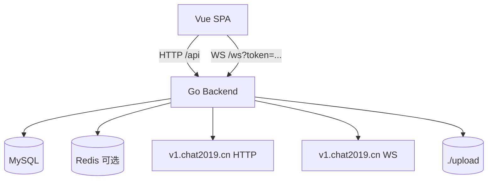

# 技术设计: Go 后端重构（API/WS 100%兼容）

## 技术方案

### 核心技术
- Go（建议 1.22+）
- HTTP Router：优先使用 `net/http` + 轻量路由（如 chi）或等价框架（以可控与可测试为先）
- WebSocket：`gorilla/websocket`（同时支持 server/client，便于实现上游转发）
- MySQL：`database/sql` + MySQL driver（可选 `sqlx` 提升开发效率）
- Redis（可选）：`redis/go-redis/v9`
- JWT：`golang-jwt/jwt/v5`（HS256）
- 日志：Go 标准库 `log/slog`（便于结构化 timing 日志）

### 实现要点

1. **路由与中间件**
   - `/api`：REST API
   - `/ws`：WebSocket（握手 token 校验）
   - `/upload/**`：静态文件（指向 `./upload`）
   - SPA 回退：`/`、`/login`、`/identity`、`/list`、`/chat`、`/chat/**` → `index.html`
   - CORS：允许所有 origin/method/header（对齐现状）
   - JWT 中间件：对齐 Spring `JwtInterceptor`（仅放行 `/api/auth/login` 与 `/api/auth/verify`）

2. **配置与兼容**
   - 保持现有环境变量命名与默认值（见 `src/main/resources/application.yml`）
   - 兼容当前 `DB_URL` 为 JDBC 格式（`jdbc:mysql://...`），Go 侧解析为 DSN
   - 保持 `CACHE_TYPE=memory|redis` 行为一致

3. **数据层**
   - 启动时执行 `CREATE TABLE IF NOT EXISTS`（至少覆盖：`identity`，其余按现状兼容策略补齐）
   - `chat_favorites/media_file/media_send_log`：以“与现有运行态一致”为目标（字段名、索引、默认值）
   - 注意 `media_upload_history` 的历史遗留读取（见 `helloagents/wiki/data.md`）

4. **上游 HTTP 代理**
   - 使用统一的 upstream HTTP client：
     - connect/read timeout：15s（对齐 `RestTemplateConfig`）
     - Header 透传：`Host/Origin/Referer/User-Agent/Cookie`
   - 上游接口保持原样请求参数与响应 body（部分接口仅在本地做缓存写入或列表增强）

5. **媒体上传与本地文件**
   - 本地落盘路径规则：`./upload/{images|videos}/yyyy/MM/dd/{uuid}_{ts}.{ext}`
   - MIME 白名单：`image/jpeg/png/gif/webp`、`video/mp4`
   - `/api/uploadMedia`：
     - MD5 计算（流式）
     - 本地文件复用查询：按现状优先查询 `media_upload_history`（保持兼容）
     - 上游上传字段名固定为 `upload_file`
     - 成功返回需补充 `port/localFilename`
   - `detectAvailablePort`：按固定端口优先级探测 `/useripaddressv23.js`（超时 800ms）

6. **缓存子系统（对齐 UserInfoCacheService）**
   - 内存模式：
     - userInfo map（`userId -> CachedUserInfo`）
     - lastMessage map（`conversationKey -> CachedLastMessage`）
     - image cache（`userId -> localPath[]`，3h 过期）
     - forceout ban（`userId -> expireAt`，5min）
   - Redis 模式：
     - L2：Redis 持久化，expireDays 默认 7
     - L1：本地短期缓存（等价于现状 Caffeine 5min/10000）
     - 批量读取：multi-get 优化（对齐现状实现意图）

7. **WebSocket 代理**
   - 下游 `/ws`：
     - 握手 token 校验（query `token`）
     - 首条 `act=sign` 注册 session→userId，并触发上游连接创建/复用
   - 上游连接池（按 userId）：
     - 最大并发 userId=2（FIFO 淘汰 + code=-6 通知 + 1s 后关闭）
     - 80s 延迟关闭上游连接
     - 上游地址动态获取：`getRandServer`，失败降级 `ws://localhost:9999`
   - forceout：
     - 上游消息 `code=-3 && forceout=true` → 5min 禁止 + 广播 + 关闭连接
     - 被禁 userId 注册时：code=-4 拒绝并关闭下游
   - 上游消息缓存增强：
     - `code=15`：缓存匹配用户信息
     - `code=7`：缓存最后消息（含会话 key 归一化补写）
   - 心跳与连接保持：
     - 周期性 ping（对齐现状 600s）

## 架构设计

## 架构决策 ADR

### ADR-001: 采用 Go 单进程后端完全替换（推荐）
**上下文:** 目标是显著降低常驻内存并保持单容器部署，同时要求 API/WS 100% 兼容。  
**决策:** 以 Go 实现现有后端全部能力（REST + WebSocket + 静态托管 + 上传目录），与 Java 版本并行开发、最终切换。  
**理由:** 单进程资源占用更低；部署链路更简单；避免双进程过渡期的内存放大与复杂度。  
**替代方案:** Go/Java 双进程渐进迁移 → 拒绝原因: 过渡期内存更高且运维复杂。  
**影响:** 需要系统化梳理兼容性细节并补充契约测试；实现周期更长但最终形态更简洁。

## API 设计

- 本次不新增/不修改对外 API，所有接口以 `helloagents/wiki/api.md` 为准。

## 数据模型

- 数据表与缓存约定以 `helloagents/wiki/data.md` 为准。
- 目标是“可在不清库的情况下”直接切换到 Go 后端继续运行。

## 安全与性能

- 不落盘明文密钥/令牌；仅通过环境变量注入
- 文件上传限制（大小、MIME 白名单）与路径安全（禁止路径穿越）
- 上游请求设置超时与失败降级策略，避免阻塞资源泄露
- WebSocket 连接管理采用锁/无锁结构保证并发安全

## 测试与部署

- 单元测试：覆盖关键纯逻辑（JWT、conversationKey、消息类型推断、URL 改写、端口探测策略等）
- 集成测试：`httptest` 覆盖关键接口返回结构与状态码；WebSocket 使用本地 mock upstream 验证转发与缓存逻辑
- Docker：多阶段构建（构建前端静态资源 + 构建 Go 二进制 → 产出运行镜像）

