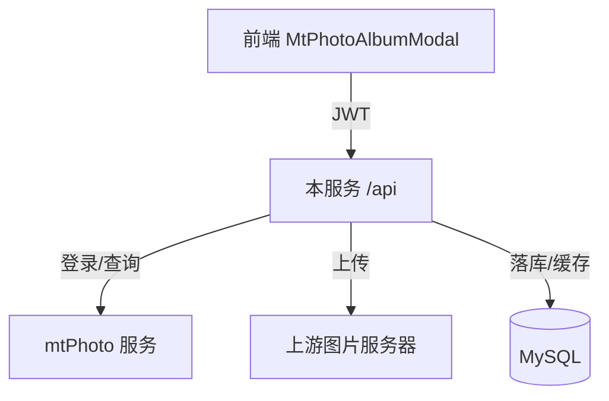

# 技术设计: mtPhoto 相册接入与导入上传

## 技术方案

### 核心技术
- 后端: Go（chi 路由）+ `net/http` 客户端
- 前端: Vue 3 + Vite + TypeScript + Pinia + Axios

### 实现要点
- 后端实现 mtPhoto Client + 认证管理器（自动登录/续期）
- 后端提供 mtPhoto 相关 API（相册/媒体分页/缩略图代理/文件路径解析/导入上传）
- 前端新增 mtPhoto 相册 Modal：相册列表 → 相册媒体列表（无限滚动 + 缩略图懒加载）→ 预览 → 导入上传
- 导入上传复用现有上游上传能力，并将导入媒体加入现有“已上传/全站图片库”数据源

## 架构设计

## 架构决策 ADR

### ADR-001: 采用后端代理 mtPhoto 并提供分页切片（已采纳）
**上下文:** 前端直接访问 mtPhoto 需要跨域与 cookie/jwt 处理，且大相册需要可控的分页与缓存策略。  
**决策:** 后端统一对接 mtPhoto，前端只访问本服务 `/api`；相册媒体由后端拉取后做分页切片并可短期缓存。  
**理由:** 统一鉴权、避免 CORS/cookie 问题、便于加固安全与做性能优化。  
**替代方案:** 前端直连 mtPhoto → 拒绝原因: 跨域与敏感凭证暴露风险高、分页与缓存不可控。  
**影响:** 后端新增模块与接口；需要严格处理敏感信息与路径安全。

## API设计

### GET /api/getMtPhotoAlbums
- **描述:** 获取 mtPhoto 相册列表
- **请求:** 无
- **响应:** `{"data":[{id,name,cover,count,startTime,endTime,...}]}`

### GET /api/getMtPhotoAlbumFiles
- **描述:** 获取相册媒体（分页切片后的扁平列表）
- **请求:** `albumId`（必填）、`page`（默认1）、`pageSize`（默认60）
- **响应:** `{"data":[{id,md5,fileType,width,height,duration,day}], "total":123, "page":1, "pageSize":60, "totalPages":3}`

### GET /api/getMtPhotoThumb
- **描述:** 代理 mtPhoto gateway 缩略图（用于封面/媒体缩略图，避免跨域与 cookie 问题）
- **请求:** `size`（如 `s260`/`h220`）、`md5`
- **响应:** 图片/视频缩略图二进制（透传 `Content-Type`）

### GET /api/resolveMtPhotoFilePath
- **描述:** 通过 md5 获取 mtPhoto 返回的本地文件路径（用于预览与导入）
- **请求:** `md5`
- **响应:** `{"filePath":"/lsp/xxx/yyy.jpg","id":695770}`

### POST /api/importMtPhotoMedia
- **描述:** 将 mtPhoto 媒体导入并上传到上游，成功后加入“已上传的文件”
- **请求:** `application/x-www-form-urlencoded`
  - `md5`（必填）
  - `userid`（必填，当前身份ID）
  - `cookieData`/`referer`/`userAgent`（可选，复用现有上游上传头）
- **响应:** 对齐现有 `/api/uploadMedia` 的成功结构（`state/msg/localFilename` 等）

## 数据模型
- 不新增数据表
- 复用:
  - `media_file`（全站图片库）
  - `media_send_log`（发送日志）
  - 图片缓存（已上传的文件列表）

## 安全与性能
- **安全:**
  - mtPhoto 凭证与 token 仅保存在服务端内存/环境变量；日志中禁止打印 token/auth_code/password
  - 解析到的本地路径必须满足白名单前缀（建议仅允许 `/lsp/`），并拒绝 `..` 等路径遍历
  - 如需要，修复现有 `/lsp/*` 静态文件服务的路径遍历风险（确保 clean 后仍在 `/lsp/` 根目录下）
- **性能:**
  - 相册媒体元数据：服务端短 TTL 缓存 + 分页切片，避免前端一次性拉取大列表
  - 缩略图：前端 `loading="lazy"`；后端透传响应头并可设置缓存头（按需）
  - 导入上传：使用流式上传（避免一次性读入内存）；必要时对并发做限制

## 测试与部署
- **测试:**
  - 后端：为 mtPhoto Client/认证管理器/路径校验/导入上传（基于 `httptest` + 临时文件）补充单测
  - 前端：执行 `npm run build` 作为编译门禁，关键交互做最小冒烟自测
- **部署:**
  - 新增环境变量并重启服务
  - 首次访问 mtPhoto 相册时由后端自动登录并缓存 token

## 配置（环境变量）
- `MTPHOTO_BASE_URL`：mtPhoto 服务地址（例如 `http://pc.zcw.work:38064`）
- `MTPHOTO_LOGIN_USERNAME`：登录请求 username（可为 mtPhoto 约定的 `__MT_RSA_ENC_V2`）
- `MTPHOTO_LOGIN_PASSWORD`：登录请求 password（加密串或 mtPhoto 要求的格式）
- `MTPHOTO_LOGIN_OTP`：可选

