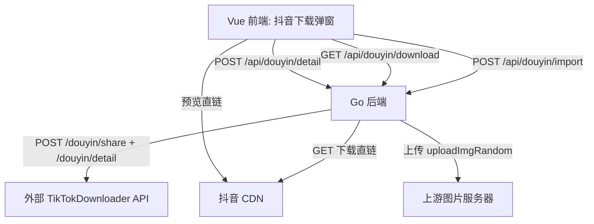

# 技术设计: 抖音作品抓取与下载对接（TikTokDownloader Web API）

## 技术方案
### 核心技术
- 后端：Go（chi 路由）+ 内置 `http.Client`
- 外部服务：TikTokDownloader Web API（FastAPI）：`/douyin/share`、`/douyin/detail`
- 前端：Vue 3 + Pinia + 既有 `MediaPreview` 组件

### 实现要点
- 后端提供统一的 `POST /api/douyin/detail`：输入解析 → 详情抓取 → 生成短期缓存 key（TTL）→ 返回给前端用于预览/下载/导入
- 下载与导入均使用 `key + index` 从服务端缓存中取出下载地址，避免前端传入任意 URL
- 下载以“流”形式返回给前端（`Content-Disposition` 设定作品标题文件名）
- 导入上传由后端拉取媒体、计算 MD5 并按用户维度去重；成功后复用现有“上传到上游 + media_file 记录 + 已上传文件缓存”链路
- 前端新增“抖音下载”弹窗：支持输入、proxy/cookie 配置、解析结果预览（直链展示）、下载（走本服务下载流）、一键导入上传（走本服务导入 API）

## 架构设计

## API设计

### POST /api/douyin/detail
- **请求:**
  - `input`：分享文本/短链/完整URL/作品ID（必填）
  - `proxy`：可选
  - `cookie`：可选
- **响应:**
  - `key`：服务端缓存 key（用于 download/import）
  - `detailId`：解析出的作品 ID
  - `type`：`视频`/`图集`/`实况`（来自 TikTokDownloader 抽取结果）
  - `title`：作品标题（使用 `desc`）
  - `coverUrl`：封面（如有）
  - `items[]`：每个可下载媒体项：
    - `index`
    - `type`：`image`/`video`
    - `url`：用于预览展示（直链）
    - `downloadUrl`：`/api/douyin/download?key=...&index=...`
    - `originalFilename`：建议文件名（用于兜底）

### GET /api/douyin/download
- **请求:** `key` + `index`
- **响应:** 二进制流（透传抖音 CDN），设置 `Content-Disposition` 为作品标题文件名

### POST /api/douyin/import
- **请求（x-www-form-urlencoded）:**
  - `userid`：当前身份 ID（必填）
  - `key`、`index`：指向解析缓存条目（必填）
  - `cookieData/referer/userAgent`：用于上传到上游图片服务器（沿用现有约定）
- **响应:** 对齐 `/api/uploadMedia` 增强返回：
  - `state=OK`、`msg`（remote filename）、`port`、`localFilename`

## 安全与性能
- **安全:**
  - download/import 不接受任意 URL，仅接受 `key+index` 并从服务端缓存读取下载直链，降低 SSRF 风险
  - 服务端不落库保存抖音 cookie/proxy；默认由前端本地保存并按请求透传
- **性能:**
  - 解析缓存采用 LRU + TTL（默认 15 分钟），避免重复解析并减少外部服务压力
  - 下载与导入均采用流式转发，避免一次性读入内存

## 测试与部署
- **测试:**
  - Go：增加 handler/解析逻辑的单元测试（使用 `httptest` 模拟 TikTokDownloader API）
  - 前端：以 `npm run build` 作为编译验证
- **部署:**
  - 新增环境变量：`TIKTOKDOWNLOADER_BASE_URL`（可选，未配置则抖音功能返回“未启用”错误）
  - 可选默认值：`DOUYIN_COOKIE`、`DOUYIN_PROXY`（仅作为默认值；页面填写优先）
