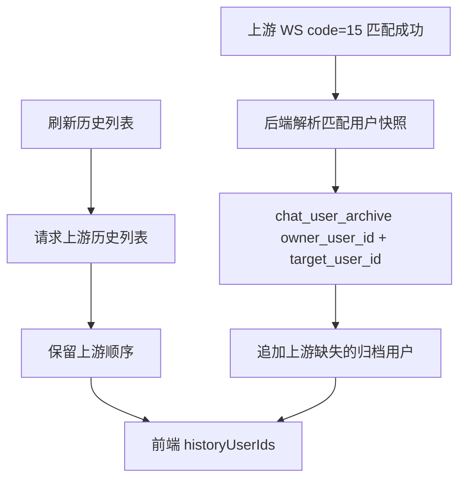

# 技术设计: 匹配未聊天用户归档

## 技术方案
### 核心技术
- Go 后端现有 `UserArchiveService` / `chat_user_archive`。
- Vue 3 + Pinia 前端状态隔离。

### 实现要点
- `UpstreamWebSocketManager` 增加可选 `UserArchiveService` 依赖，保持现有构造调用兼容。
- `code=15` 分支保存匹配用户快照，来源标记为 `history`。
- `chat` store 增加 `listOwnerUserId` 和身份检查逻辑，加载列表前确认当前 owner。

## 设计边界
- **范围内:** 匹配事件归档、历史列表缺失用户回填、前端列表身份隔离。
- **范围外:** 新表结构、收藏行为、消息历史缓存、Android 客户端。
- **模块职责:** 后端负责持久化可恢复用户快照；前端负责当前页面状态不跨身份复用。
- **接口契约:** 无新增 API；`NewUpstreamWebSocketManager` 通过可选参数兼容新增依赖。
- **数据边界:** 仅写入已有 `chat_user_archive`，owner 使用当前 WebSocket 身份 ID。
- **依赖边界:** 不新增第三方依赖。
- **大型项目最小改动:** 只修改直接相关后端管理器、前端 store 和测试。

## 架构设计

## API设计
无新增或变更公开 API。

## 数据模型
复用 `chat_user_archive`，不新增迁移。

## 安全与性能
- **安全:** 不处理明文密钥，不新增生产外部服务连接；只保存上游已经下发的匹配用户展示字段。
- **性能:** 单个匹配事件写入一条归档记录；列表刷新仍先使用上游返回顺序，再追加缺失归档项。

## 测试与部署
- **测试:** 新增/调整 Go WebSocket 单元测试与前端 Pinia store 测试；运行相关最小测试和构建/后端测试。
- **部署:** 正常构建部署，无新增环境变量和数据库迁移。
