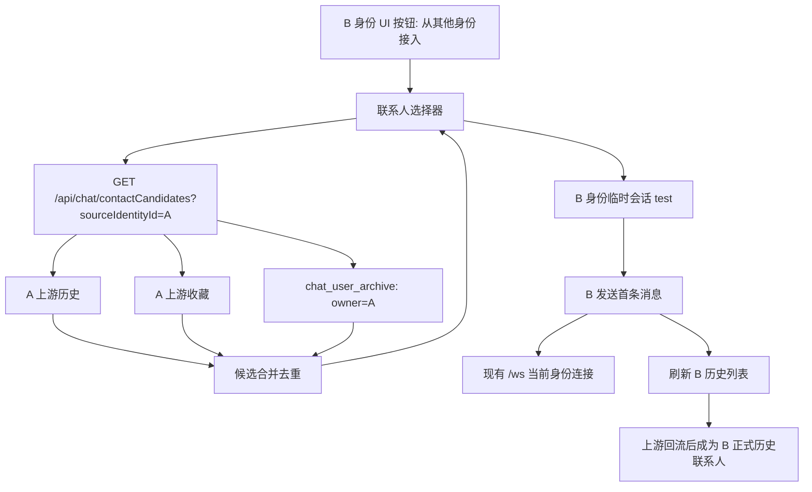

# 技术设计: 跨身份联系人接入

## 技术方案

### 核心技术
- Go + chi：新增联系人候选聚合接口。
- MySQL/PostgreSQL：复用 `chat_user_archive`。
- Vue 3 + Pinia：新增跨身份联系人选择入口与临时会话状态。
- WebSocket：继续使用当前身份已建立连接发送消息，不改 WS 协议。

### 实现要点
- 后端新增 `GET /api/chat/contactCandidates?sourceIdentityId=<id>&includeUpstream=1`。
- 候选数据合并顺序：上游历史、上游收藏、本地归档；按 `targetUserId` 去重。
- 前端新增选择器组件：先选来源身份，再搜索/选择候选联系人。
- 选中目标后调用当前身份下的 `enterChat(targetUser, true)`，并标记该会话为临时接入。
- `useMessage` 在文本、图片、视频发送成功或回显确认后触发当前身份历史列表刷新。
- `message` store 将所有 `getMessages/addMessage/loadHistory/firstTidMap/clearHistory/confirmOutgoingEcho` 的 key 从 `targetUserId` 改为身份隔离会话 key。

## 架构设计



## 架构决策 ADR

### ADR-20260524-01: 以临时会话接入替代跨身份复用连接
**上下文:** A 身份匹配到 test 后，B 身份希望直接联系 test。现有 WebSocket 代理要求下游先 sign，并且后端只转发与已注册 `userId` 一致的消息。
**决策:** 不复用 A 身份连接，不让 B 伪装或接管 A 的 WS 状态；选中 test 后只在 B 身份下创建临时会话，发送仍走 B 的当前 WS 连接。
**理由:** 符合当前安全边界，避免跨身份注入和 forceout 风险；上游关系由 B 的真实发送行为生成。
**替代方案:** 后端提供跨身份代理发送 → 拒绝原因: 需要绕过现有 WS 绑定约束，容易造成身份混淆和安全风险。
**影响:** 前端需要处理临时会话状态和首发失败状态。

### ADR-20260524-02: 复用 `chat_user_archive` 而非新增联系人池表
**上下文:** 项目已在上游历史/收藏列表和 `code=15` 匹配成功时写入 `chat_user_archive`。
**决策:** 候选接口优先复用 `chat_user_archive`，不新增数据库迁移。
**理由:** 减少数据模型复杂度，直接满足“包含数据库里存储的匹配对象”的需求。
**替代方案:** 新建 `chat_contact_handoff` 表 → 拒绝原因: 仅用于选择候选会重复存储 target 快照，当前阶段收益不足。
**影响:** 需要为 `UserArchiveService` 增加只读候选查询能力或在 DB 实现上新增方法。

### ADR-20260524-03: Message Store 使用身份隔离 key
**上下文:** 当前消息缓存以 `targetUserId` 为 key，A 和 B 同时联系 test 时会串缓存。
**决策:** 前端统一使用 `conversationKey = currentIdentityId + ":" + targetUserId` 作为本地消息缓存 key。
**理由:** 保持后端上游会话语义不变，同时解决前端内存状态串会话问题。
**替代方案:** 切换身份时彻底清空全部消息缓存 → 拒绝原因: 虽能避免串会话，但无法同时保留多身份本地消息状态，且对临时会话体验差。
**影响:** 需要集中调整 message store 调用点和测试。

## API设计

### GET `/api/chat/contactCandidates`
- **描述:** 查询某个来源身份可被当前身份接入的联系人候选。
- **请求参数:**
  - `sourceIdentityId`：必填，来源身份 ID。
  - `includeUpstream`：可选，默认 `1`；为 `0` 时只查本地归档。
  - `q`：可选，按用户 ID/昵称做服务端过滤。
  - `limit`：可选，默认 `100`，最大 `300`。
- **响应:**
```json
{
  "code": 0,
  "msg": "success",
  "data": {
    "sourceIdentityId": "A",
    "items": [
      {
        "targetUserId": "test",
        "targetUserName": "test昵称",
        "name": "test昵称",
        "nickname": "test昵称",
        "sex": "未知",
        "age": "0",
        "area": "未知",
        "lastMsg": "匹配成功",
        "lastTime": "2026-05-24 12:57:00",
        "sources": ["archive", "history"],
        "localArchived": true,
        "snapshot": {}
      }
    ]
  }
}
```
- **错误处理:**
  - `sourceIdentityId` 为空时返回 `400`。
  - 上游失败但本地归档有数据时返回 `code=0` 并附带 `warnings`。
  - 上游失败且本地无数据时返回空列表和 `warnings`，不阻塞前端选择器关闭。

## 数据模型

不新增表。复用:

```sql
chat_user_archive(owner_user_id, target_user_id, snapshot_json, last_msg, last_time, seen_in_history, seen_in_favorite, last_seen_at)
```

需要新增 Go 侧只读模型:

```go
type ContactCandidate struct {
    TargetUserID   string   `json:"targetUserId"`
    TargetUserName string   `json:"targetUserName,omitempty"`
    Name           string   `json:"name,omitempty"`
    Nickname       string   `json:"nickname,omitempty"`
    Sex            string   `json:"sex,omitempty"`
    Age            string   `json:"age,omitempty"`
    Area           string   `json:"area,omitempty"`
    LastMsg        string   `json:"lastMsg,omitempty"`
    LastTime       string   `json:"lastTime,omitempty"`
    Sources        []string `json:"sources"`
    LocalArchived  bool     `json:"localArchived,omitempty"`
    Snapshot       map[string]any `json:"snapshot,omitempty"`
}
```

## 安全与性能
- **身份边界:** 接口的 `sourceIdentityId` 只用于读取候选；发送消息仍只能使用当前已选择身份的 WS 连接。
- **输入验证:** 限制 `sourceIdentityId`、`q` 长度；`limit` 设上限；过滤空 targetUserId 和 source 自身 ID。
- **隐私:** 不返回 Cookie、JWT、访问码等敏感字段；`snapshot` 需要复用归档快照清洗逻辑。
- **性能:** 本地归档查询使用 `owner_user_id + last_seen_at` 索引；上游历史/收藏请求设置超时并允许跳过。
- **降级:** 上游不可用时返回本地归档候选；前端展示“仅本地归档”提示。

## 测试与部署
- **后端测试:** 覆盖候选接口的归档-only、上游+归档去重、上游失败降级、参数校验。
- **前端测试:** 覆盖按钮打开、来源身份选择、候选搜索、选中进入临时会话、首发后刷新历史、消息缓存身份隔离。
- **回归测试:** `go test ./...`；`cd frontend && npm run build`；如已有 Vitest 可运行相关前端单测。
- **部署:** 无数据库迁移；后端和前端同版本发布即可。
