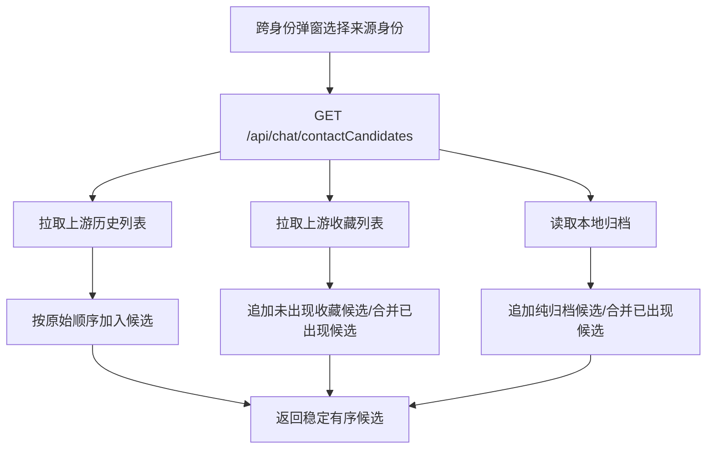

# 技术设计: 修复跨身份联系人候选顺序

## 技术方案
### 核心技术
- Go HTTP handler 与本地归档服务。
- Vue 3 跨身份联系人弹窗保持现有渲染结构。
- Go 单元测试验证候选聚合顺序。

### 实现要点
- 在 `handleGetContactCandidates` 中明确候选排序优先级：
  1. 上游历史列表原始顺序。
  2. 上游收藏列表原始顺序，跳过已在历史中出现的用户但合并来源标签。
  3. 本地归档补充用户，跳过已在上游出现的用户但合并字段和标签。
- 保持 `addContactCandidate` 的“已存在不移动位置”行为，并补充测试锁定该约束。
- 审查 `ListContactCandidates` 当前 `ORDER BY last_seen_at DESC, updated_at DESC, id DESC` 的语义：
  - 确认仅用于纯归档补充的追加顺序。
  - 若用户仍要求“纯归档也等于最后一次实际列表顺序”，再引入 `last_list_source` / `last_list_position` 或等价字段。
- 前端 `CrossIdentityContactPicker.vue` 优先不改 UI；如后端新增排序元数据，前端不依赖该字段。

## 架构设计


## 架构决策 ADR
### ADR-202605241501: 跨身份候选顺序以上游原始顺序为主
**上下文:** 当前候选聚合引入本地归档后，用户可看到更多联系人，但顺序可能与来源身份实际查看列表不一致。  
**决策:** 候选接口以来源身份的上游历史/收藏列表返回顺序作为主排序，本地归档仅作为补充和字段增强。  
**理由:** 用户感知的“实际顺序”来自历史/收藏列表；归档时间戳是缓存/刷新行为产生的技术顺序，不能代表用户意图。  
**替代方案:** 完全按数据库 `last_seen_at` 排序 → 拒绝原因: 会把批量刷新时间当作用户浏览顺序，导致错乱。  
**影响:** API 响应结构保持兼容；排序逻辑更贴近用户预期。

## API设计
### GET /api/chat/contactCandidates
- **请求:** 沿用 `sourceIdentityId/includeUpstream/q/limit/cookieData/referer/userAgent`。
- **响应:** 沿用 `data.items`。候选项顺序定义为稳定契约：历史原序优先、收藏原序追加、归档补充追加。

## 数据模型
优先不新增数据字段。

可选增强（仅当纯归档顺序仍无法满足需求时执行）:
```sql
-- 预留方案，实施前需确认当前数据库方言和迁移策略
ALTER TABLE chat_user_archive ADD COLUMN list_position BIGINT NULL;
ALTER TABLE chat_user_archive ADD COLUMN last_list_source VARCHAR(32) NULL;
```

## 安全与性能
- **安全:** 不新增权限范围；接口仍受 JWT 中间件保护；不输出 cookie、token 等敏感字段。
- **性能:** 保持现有最多 300 条限制；合并逻辑为 O(n)，不增加外部请求次数。
- **兼容:** 不破坏现有响应字段；前端旧逻辑可继续消费候选数组。

## 测试与部署
- **测试:**
  - 后端单元测试覆盖历史顺序、收藏追加顺序、归档合并不移动位置、纯归档兜底顺序。
  - 前端如无 UI 变更，可复用现有弹窗测试；若传参或显示调整，补充组件测试。
- **部署:**
  - 若不新增数据库字段，常规构建部署即可。
  - 若启用可选数据字段，需先执行兼容性迁移，再发布服务。
