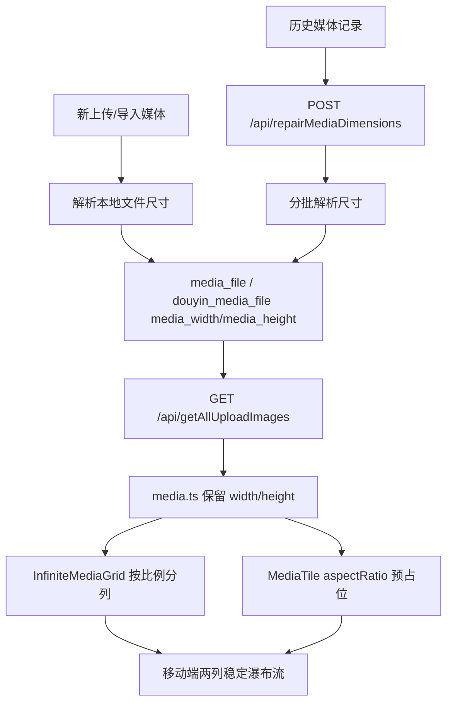

# 技术设计: 修复移动端图片瀑布流单侧空白

## 技术方案
### 核心技术
- Go 后端标准库 `image.DecodeConfig` 读取图片宽高。
- 数据库 nullable int 字段持久化媒体尺寸。
- 历史修复接口沿用现有 `dry-run/commit/startAfterId/limit` 批处理模式。
- Vue 3 `computed` 保持瀑布流分列响应式计算。

### 实现要点
- `media_file`、`douyin_media_file` 新增 `media_width`、`media_height` 字段。
- `MediaFileDTO` 增加 `Width`、`Height` 可选字段，JSON 字段为 `width`、`height`。
- `GetAllUploadImagesWithDetailsBySource` 查询并返回数据库尺寸字段；不在主列表路径做全量历史修复。
- 新增尺寸解析辅助函数：
  - 图片: 对本地文件使用 `image.DecodeConfig` 读取宽高。
  - 视频: 本轮仅把视频 poster 或视频自身尺寸作为可选扩展；移动端瀑布流问题优先处理图片。无尺寸时前端保留 `aspect-video` 兜底。
- 新增 `RepairMediaDimensions` 服务和 `/api/repairMediaDimensions` handler：
  - 请求支持 `commit`、`source`、`startAfterId`、`limit`、`force`。
  - `source` 与现有视频封面修复保持一致，支持 `local`、`douyin`；处理全部来源时由调用方分别跑两次，避免跨表游标混淆。
  - 默认只处理 `media_width` 或 `media_height` 为空/无效的记录；`force=true` 时重新解析并覆盖已有尺寸。
  - 文件不存在、路径非法、解析失败、非图片等情况只计数并跳过，不中断批次。
- 新媒体写入路径在保存本地文件后解析尺寸，并在 `SaveUploadRecord`、`SaveDouyinUploadRecord` 或导入写入时保存尺寸。
- `frontend/src/stores/media.ts` 映射 `getAllUploadImages` 数据时保留 `width`、`height`。
- `AllUploadImageModal.vue` 在 masonry 模式下向 `MediaTile` 传入 `aspect-ratio`，与 mtPhoto 调用方式对齐。
- `InfiniteMediaGrid.vue` 将高度估算逻辑集中为函数，优先使用 `item.width/item.height`，缺失时按媒体类型和默认比例兜底。

## 架构设计


## 架构决策 ADR
### ADR-202605270350: 使用持久化尺寸和历史回填修复瀑布流
**上下文:** 问题根因是瀑布流分列估算缺少真实宽高。现有历史修复接口不处理 `media_file`、`douyin_media_file` 的宽高，单纯在列表接口即时解析会把历史数据处理混入用户请求路径。
**决策:** 新增数据库尺寸字段和 `/api/repairMediaDimensions` 历史回填接口；新媒体入库时同步写入尺寸；列表接口只读取已持久化字段。
**理由:** 历史处理可控、可 dry-run、可分批、可重跑；用户打开媒体库时不承担批量文件解析成本。
**替代方案:** 每次 `getAllUploadImages` 即时解析本地文件尺寸 → 拒绝原因: 历史库大时会增加列表接口 I/O 和延迟，且文件不存在等问题会污染普通查询链路。
**影响:** 增加数据库迁移和一个维护接口；前端布局更稳定；历史缺失文件会被统计但不会自动删除或修改业务记录。

## API设计
### GET /api/getAllUploadImages
- **请求:** 保持现有 `page`、`pageSize`、`source`、`douyinSecUserId`。
- **响应:** `data[]` 中增加可选字段。
```json
{
  "url": "/upload/images/2026/05/27/a.jpg",
  "type": "image",
  "width": 1080,
  "height": 1920
}
```

### POST /api/repairMediaDimensions
- **请求:**
```json
{
  "commit": false,
  "source": "local",
  "startAfterId": 0,
  "limit": 200,
  "force": false
}
```
- **字段说明:**
  - `commit`: `false` 为 dry-run，只统计不写库；`true` 才更新数据库。
  - `source`: `local` 处理 `media_file`，`douyin` 处理 `douyin_media_file`。
  - `startAfterId`: 游标，只处理 `id > startAfterId`。
  - `limit`: 单次最多扫描记录数，默认 200，最大 2000。
  - `force`: `false` 只处理缺尺寸记录；`true` 覆盖已有尺寸。
- **响应:**
```json
{
  "commit": false,
  "source": "local",
  "force": false,
  "startAfterId": 0,
  "nextAfterId": 120,
  "hasMore": true,
  "limit": 200,
  "scanned": 200,
  "needUpdate": 180,
  "updated": 0,
  "fileMissing": 8,
  "invalidPath": 1,
  "decodeFailed": 3,
  "unsupported": 8,
  "skipped": 0,
  "warnings": [
    "id=42 file missing: /images/2026/01/a.jpg"
  ]
}
```

## 数据模型
### MySQL
```sql
ALTER TABLE media_file ADD COLUMN media_width INT NULL COMMENT '媒体宽度（用于前端瀑布流布局）';
ALTER TABLE media_file ADD COLUMN media_height INT NULL COMMENT '媒体高度（用于前端瀑布流布局）';
ALTER TABLE douyin_media_file ADD COLUMN media_width INT NULL COMMENT '媒体宽度（用于前端瀑布流布局）';
ALTER TABLE douyin_media_file ADD COLUMN media_height INT NULL COMMENT '媒体高度（用于前端瀑布流布局）';
```

### PostgreSQL
```sql
ALTER TABLE media_file ADD COLUMN IF NOT EXISTS media_width int NULL;
ALTER TABLE media_file ADD COLUMN IF NOT EXISTS media_height int NULL;
ALTER TABLE douyin_media_file ADD COLUMN IF NOT EXISTS media_width int NULL;
ALTER TABLE douyin_media_file ADD COLUMN IF NOT EXISTS media_height int NULL;
```

## 安全与性能
- **安全:** 历史处理只解析服务已管理的 `upload/` 本地文件路径；继续使用 `resolveUploadAbsPath`，避免路径遍历。
- **安全:** 文件不存在、路径非法、解析失败均不删除记录、不写入伪造尺寸，只返回统计。
- **安全:** 维护接口默认 dry-run；只有 `commit=true` 才写库。
- **性能:** 图片尺寸解析使用 `DecodeConfig`，只读文件头而非完整解码。
- **性能:** 历史处理单次 limit 受控，使用 `LIMIT+1` 探测 `hasMore`，调用方按游标续跑。
- **性能:** 普通列表接口只读取数据库尺寸字段，避免打开媒体库时扫描历史文件。
- **性能:** 前端使用 aspect ratio 预占位，减少图片加载后的重排和滚动抖动。

## 测试与部署
- **后端测试:** 覆盖尺寸字段迁移后的 DTO 查询、上传写入尺寸、历史回填 dry-run、commit、force、文件缺失、路径非法、解析失败。
- **前端测试:** 覆盖 `InfiniteMediaGrid` 分列估算、`AllUploadImageModal` 传入 `aspectRatio`、缺尺寸兜底。
- **构建验证:** 执行 `go test ./...` 和 `cd frontend && npm run build`。
- **手工验证:** 先 dry-run 调用 `repairMediaDimensions`，确认缺失文件统计；再小批量 commit 回填；移动端打开媒体库 masonry 模式观察两列是否持续均衡。
