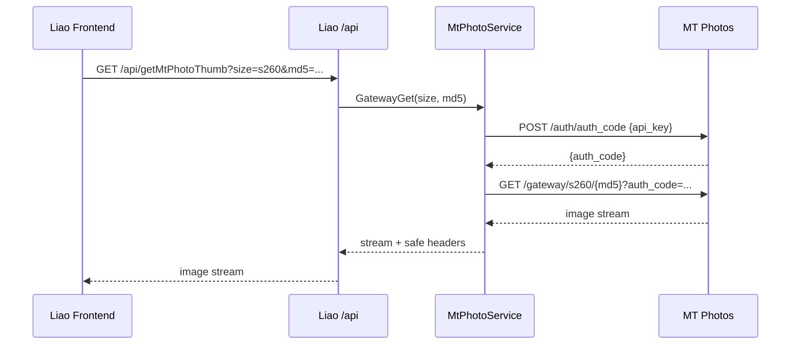

# 技术设计: mtPhoto API Key 接入方式迁移

## 技术方案

### 核心技术
- Go 后端 `net/http` 客户端与现有 `MtPhotoService`。
- MT Photos OpenAPI 快照: `helloagents/wiki/modules/mtphotos-openapi.json`。
- 认证方式: `x-api-key` 请求头 + `/auth/auth_code` 返回的媒体授权码。

### 实现要点
- 在 `config.Config` 中新增 `MtPhotoAPIKey string`，读取环境变量 `MTPHOTO_API_KEY`。
- 调整 `NewMtPhotoService` 构造参数，保留 `baseURL`、`apiKey`、`lspRoot`、`httpClient`，移除主链路对 username/password/otp 的依赖。
- 将 `configured()` 判定改为 `baseURL != "" && apiKey != ""`。
- 新增或改造 `ensureAuthCode(ctx, force)`:
  - 调用 `POST /auth/auth_code`，JSON body 为 `{"api_key":"..."}`。
  - 缓存 `auth_code`，本地过期时间按 23 小时或响应中可解析时间提前 5 分钟计算。
  - 并发请求通过 `MtPhotoService.mu` 串行刷新，避免同一时刻多次换码。
- 改造通用请求函数:
  - 普通 JSON API 请求统一加 `x-api-key: <MTPHOTO_API_KEY>`。
  - `/gateway/*` 媒体请求在 URL query 中添加 `auth_code`，不再使用 `Cookie: auth_code=...`。
  - 401/403 触发一次强制刷新 `auth_code` 后重试媒体请求；普通 API 请求不需要刷新 auth_code，但应返回明确鉴权错误。
- 保持现有本地 handler 和前端 API wrapper 兼容，避免调整 UI。

## 设计边界
- **范围内:** mtPhoto 上游客户端认证方式、媒体网关授权码拼接、配置项、测试和知识库。
- **范围外:** 不代理全部上游 OpenAPI；不新增 UI 配置页；不改变本地路由路径；不改数据库结构。
- **模块职责:** `internal/config` 负责读取配置；`MtPhotoService` 负责所有上游 MT Photos HTTP 细节；handler 继续只做参数校验、响应裁剪和错误映射；前端继续调用本地 `/api/*`。
- **接口契约:** 本地 `/api/getMtPhoto*`、`/api/downloadMtPhotoOriginal`、`/api/importMtPhotoMedia` 请求/响应保持兼容；新增环境变量 `MTPHOTO_API_KEY`；旧 `MTPHOTO_LOGIN_USERNAME/PASSWORD/OTP` 标记废弃。
- **数据边界:** 不新增表、不迁移数据；导入仍写 `media_file`，收藏仍写 `mtphoto_folder_favorite`。
- **依赖边界:** 不新增第三方依赖；复用标准库和现有测试工具。
- **大型项目最小改动:** 聚焦 `internal/config`、`internal/app/mtphoto_client.go`、`internal/app/app.go` 和对应测试；避免重命名本地 HTTP API、前端 store 或媒体组件。

## 架构设计

## 架构决策 ADR

### ADR-20260529-01: mtPhoto 上游认证改为 API Key 优先
**上下文:** MT Photos 当前 OpenAPI 明确提供 `api-key` security scheme，并在文档使用说明中要求通过 `x-api-key` 调用普通 API，通过 `/auth/auth_code` 获取媒体访问授权码。现有实现依赖账号密码登录和 `jwt` 请求头，和当前文档不一致。

**决策:** Liao 的 mtPhoto 上游客户端改为以 `MTPHOTO_API_KEY` 为唯一主认证凭据；普通 API 请求使用 `x-api-key`；媒体资源请求使用 `/auth/auth_code` 换取的 query 参数 `auth_code`。

**理由:** API Key 更适合作为服务端到服务端集成凭据，避免保存用户登录密码和 OTP；实现与上游文档一致；本地前端无需感知上游凭据。

**替代方案:** 继续使用 `/auth/login` + `jwt` 头。拒绝原因: 与当前文档偏离，仍需保存账号密码，且媒体 URL 文档要求 query 参数 `auth_code`。

**影响:** 需要新增环境变量并更新部署配置；测试中大量登录/refresh mock 需要改为 API Key/auth_code mock；上线前必须配置 `MTPHOTO_API_KEY`。

## API设计

### 本地 API
本地 HTTP API 不改路径、不改主要响应结构。

| 本地接口 | 兼容策略 |
|----------|----------|
| `GET /api/getMtPhotoAlbums` | 仍返回 `{data: albums}` |
| `GET /api/getMtPhotoAlbumFiles` | 仍返回分页字段 |
| `GET /api/getMtPhotoFolderRoot` | 仍返回目录结构 |
| `GET /api/getMtPhotoFolderContent` | 仍返回目录 + 时间线分页 |
| `GET /api/getMtPhotoThumb` | 仍为图片流代理 |
| `GET /api/downloadMtPhotoOriginal` | 仍为下载流代理 |
| `GET /api/resolveMtPhotoFilePath` | 仍返回 `id`、`filePath` |
| `POST /api/importMtPhotoMedia` | 仍导入本地媒体库 |

### 上游 API 调用

| 能力 | 上游接口 | 认证 |
|------|----------|------|
| 获取授权码 | `POST /auth/auth_code` | body `api_key` |
| 相册列表 | `GET /api-album` | `x-api-key` |
| 相册文件 | `GET /api-album/filesV2/{id}?listVer=v2` | `x-api-key` |
| 目录根节点 | `GET /gateway/folders/root` | `x-api-key` |
| 目录内容 | `GET /gateway/foldersV2/{id}` | `x-api-key` |
| 目录时间线 | `GET /gateway/folderFiles/{id}` | `x-api-key` |
| 缩略图 | `GET /gateway/{type}/{md5}?auth_code=...` | `auth_code` |
| 原文件下载 | `GET /gateway/fileDownload/{id}/{md5}?auth_code=...` | `auth_code` |
| MD5 查路径 | `POST /gateway/filesInMD5` | `x-api-key` |
| 文件详情 | `GET /gateway/fileInfo/{id}/{md5}` | `x-api-key` |

## 数据模型
无数据库结构变更。

## 安全与性能
- **安全:** `MTPHOTO_API_KEY` 只从环境变量读取，不写入日志、响应、知识库示例真实值；媒体代理继续只透传 `Content-Type`、`Cache-Control`、`Content-Length`、`Accept-Ranges`、`Content-Disposition` 等必要头；`getMtPhotoThumb` 保留 size 白名单。
- **安全:** `LSP_ROOT` 路径解析和 `/upload` 路径 MD5 计算保持现有越界校验；不因认证迁移放宽本地文件访问边界。
- **性能:** `auth_code` 本地缓存 23 小时，避免每个缩略图请求都调用 `/auth/auth_code`；相册与相册文件缓存继续保留；401/403 才强制刷新一次。
- **回滚:** 保留旧配置字段在代码中短期可读但不作为默认主链路；如上线失败，可回滚本方案代码并恢复 `MTPHOTO_LOGIN_*` 配置。

## 测试与部署
- **测试:** 更新 `mtphoto_client*`、`mtphoto_handlers*`、`mtphoto_folder*`、`mtphoto_download*`、`video_extract*` 中对上游认证请求头的断言；新增 API Key 配置加载测试；运行 `go test ./...`。
- **前端验证:** 运行 `cd frontend && npm run build`，确认本地接口兼容未破坏 TS 类型。
- **部署:** 在运行环境配置 `MTPHOTO_BASE_URL` 和 `MTPHOTO_API_KEY`；移除或停止依赖 `MTPHOTO_LOGIN_USERNAME`、`MTPHOTO_LOGIN_PASSWORD`、`MTPHOTO_LOGIN_OTP`。
