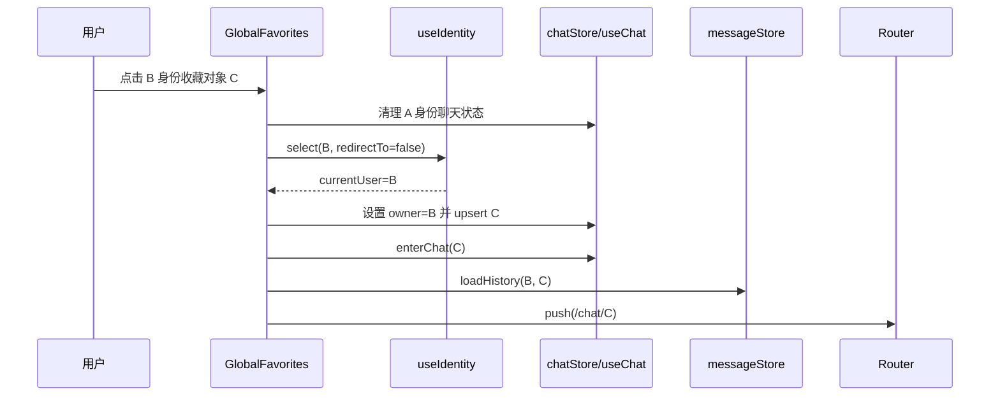

# 技术设计: 修复全局收藏切换身份进入聊天异常

## 技术方案
### 核心技术
- Vue 3 Composition API
- Pinia stores
- Vue Router
- Vitest / Vue Test Utils

### 实现要点
- 将 `useIdentity.select(identity)` 扩展为 `select(identity, options?)`，支持 `redirectTo?: string | false`，默认仍为 `/list`。
- 在 `GlobalFavorites.vue` 中移除 `setTimeout`，按顺序执行：关闭预览/抽屉状态、断开旧连接、清理旧聊天状态、选择目标身份、准备目标聊天对象、加载历史、跳转 `/chat/:targetUserId`。
- 复用或新增 `useChat` 的最小 helper，将收藏项转换成 `User` 并进入当前身份会话；必要时调用 `chatStore.upsertUser()`，保证 `ChatRoomView` 的路由兜底可找到目标用户。
- 切换身份前执行与现有身份切换一致的清理：`disconnect(true)`、`messageStore.resetAll()`、`chatStore.clearAllUsers()`、取消匹配状态。
- 切换身份后调用 `chatStore.ensureListOwner` 或等价公开方法设定新 owner，再插入目标用户，避免后续 owner 初始化把 `currentChatUser` 清掉。
- 历史加载使用 `messageStore.loadHistory(newIdentity.id, targetUserId, { isFirst: true, firstTid: '0', myUserName: newIdentity.name })`，失败不阻断路由。

## 设计边界
- **范围内:** 全局收藏入口的状态编排、身份选择跳转参数化、目标聊天对象准备、前端测试。
- **范围外:** 后端 `/favorite/*`、`/getMessageHistory`、`/getHistoryUserList` 行为；不引入服务端聚合接口。
- **模块职责:** `GlobalFavorites.vue` 负责用户动作和流程编排；`useIdentity` 负责设置当前身份并更新最近使用；`useChat`/`chatStore` 负责聊天对象和消息加载；`ChatRoomView` 保持路由兜底。
- **接口契约:** 不变更后端 API；前端内部函数 `select()` 新增可选参数，默认兼容现有调用。
- **数据边界:** 不修改数据库；消息缓存仍按 `ownerUserId:targetUserId` 隔离。
- **依赖边界:** 不新增 npm 依赖；不改构建配置。
- **大型项目最小改动:** 限定在全局收藏、身份选择、聊天状态相关文件；不重构路由体系、不移动组件、不统一所有跨身份入口。回滚方式为恢复上述前端文件修改。

## 架构设计


## 架构决策 ADR
### ADR-20260529-01: 全局收藏进入聊天采用确定性流程
**上下文:** 当前实现通过 `select(identity)` 固定跳 `/list` 后再 `setTimeout` 设置聊天对象并跳 `/chat`，与列表 owner 清理逻辑产生竞态。
**决策:** 让身份选择支持不自动跳转，由全局收藏入口在同一 async 流程中完成身份设置、聊天对象准备、历史加载和最终路由跳转。
**理由:** 状态顺序可验证，不依赖固定时间；同时保留身份选择页的默认 `/list` 行为。
**替代方案:** 增大 `setTimeout` 延时或等待 `/list` 加载完成后再跳转 → 拒绝原因: 仍依赖 UI 页面副作用，慢网络和异常分支不可控。
**影响:** 全局收藏流程更稳定；`useIdentity.select()` 增加内部可选参数，需要测试默认兼容性。

### ADR-20260529-02: 不为本问题新增后端聚合接口
**上下文:** 收藏对象元数据有限，理论上可新增接口返回身份、收藏对象和历史首屏。
**决策:** 本次不新增后端接口，使用现有收藏记录和消息历史接口完成修复。
**理由:** 当前缺陷是前端状态竞态；新增接口会扩大影响面和验证成本。
**替代方案:** 新增 `/favorite/openChat` 之类聚合接口 → 拒绝原因: 不符合最小改动，且不能直接解决前端路由状态清理竞态。
**影响:** 首屏对方资料仍以收藏名为主，完整资料由后续列表加载或历史消息补齐。

## API设计
无后端 API 变更。

前端内部接口建议:
```ts
select(identity, options?: { redirectTo?: string | false }): Promise<void>
```

- `redirectTo` 省略时保持现有 `/list`。
- `redirectTo: false` 时只设置身份和更新最近使用，不触发路由跳转。
- `redirectTo: '/chat/:id'` 可选保留，不作为本方案首选；全局收藏入口建议显式完成聊天状态准备后再 `router.push()`。

## 数据模型
无数据模型变更。

前端最小目标用户对象:
```ts
{
  id: targetUserId,
  name: targetUserName || `用户${targetUserId.slice(0, 4)}`,
  nickname: targetUserName || `用户${targetUserId.slice(0, 4)}`,
  sex: '未知',
  ip: '',
  isFavorite: true,
  lastMsg: '暂无消息',
  lastTime: '刚刚',
  unreadCount: 0
}
```

## 安全与性能
- **安全:** 不连接生产服务，不保存密钥或令牌；不变更权限、支付和敏感数据处理；仅使用已有身份 ID 和收藏用户 ID。
- **隐私:** 不新增本地持久化字段；身份 cookie 仍沿用现有 `identityStore` 机制。
- **性能:** 去除固定 500ms 等待后，成功路径更快；历史加载仍为现有单次请求。
- **稳定性:** 历史加载失败不应阻断 `currentChatUser` 和路由，避免空聊天室回退。

## 测试与部署
- **测试:**
  - `useIdentity.select()` 默认仍跳 `/list`。
  - `useIdentity.select(identity, { redirectTo: false })` 不触发路由跳转但设置 `currentUser`。
  - `GlobalFavorites.vue` 直接切换时不调用 `setTimeout`，按顺序清理旧状态、设置新身份、进入聊天并跳 `/chat/:targetUserId`。
  - 模拟 owner 切换清理后，目标用户仍存在且 `currentChatUser.id === targetUserId`。
  - 历史加载失败时仍显示目标聊天对象并停留 `/chat/:targetUserId`。
- **验证命令:**
  - `cd frontend && npm run build`
  - 如测试脚本可用，运行相关 Vitest 用例。
- **部署:** 仅前端源码变更；生产构建按现有流程输出，避免提交 `src/main/resources/static/` 产物。
