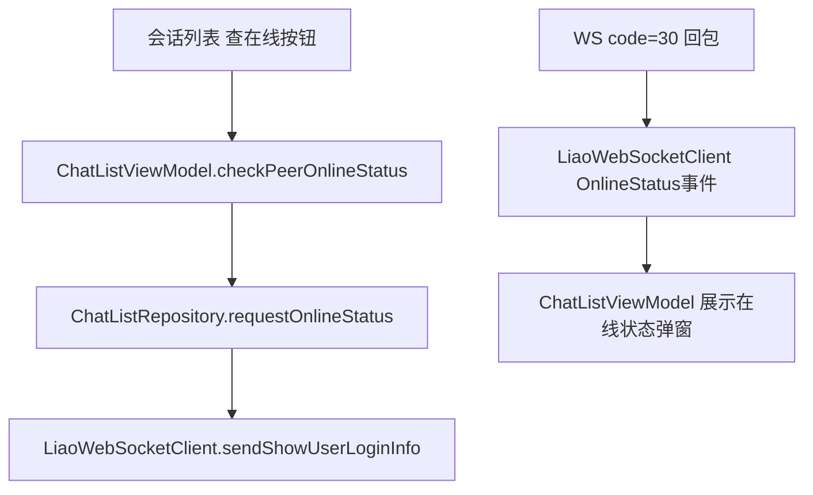

# 技术设计: Android 会话列表查询在线状态

## 技术方案
### 核心技术
- Kotlin、Jetpack Compose、ViewModel、Kotlin Flow、OkHttp WebSocket、MockK/JUnit。

### 实现要点
- `LiaoWsEvent.OnlineStatus` 增加 `isOnline: Boolean?` 与 `lastTime: String`。
- `LiaoWebSocketClient` 在 `code=30` 分支读取根 JSON 的 `data.IF_Online` 和 `data.TimeAll`。
- `ChatListRepository` 增加 `requestOnlineStatus(peerId)`，读取当前身份并复用 `sendShowUserLoginInfo`。
- `ChatListViewModel` 增加查询中状态、在线状态弹窗状态，监听 `OnlineStatus` 事件并展示结果。
- `ChatListScreenContent` 在会话项动作区增加“查在线”按钮，并通过 `AlertDialog` 展示结果。

## 设计边界
- **范围内:** Android 会话列表查询在线状态闭环。
- **范围外:** 修改服务端、修改 Vue、改变聊天页既有行为、持久化在线状态。
- **模块职责:** WebSocket 模块只解析协议事件；Repository 负责读取当前身份并发送协议；ViewModel 负责 UI 状态；Compose 负责渲染按钮和弹窗。
- **接口契约:** 复用 WebSocket payload `{ act: "ShowUserLoginInfo", id, msg, randomvipcode }`；`OnlineStatus` 事件字段向后兼容保留 `message`。
- **数据边界:** 不新增 Room/DataStore 字段；在线状态仅保存在内存 UI state 中。
- **依赖边界:** 不新增依赖，不升级 Gradle 或 Android 依赖。
- **大型项目最小改动:** 仅修改会话列表、WebSocket 事件和对应测试，避免重构聊天页或公共导航。

## 架构设计

## 安全与性能
- **安全:** 不写入敏感信息，不新增权限，不扩大在线状态存储。
- **性能:** 每次点击只发送一次 WebSocket 指令，回包仅更新内存状态。

## 测试与部署
- **测试:** 先补 WebSocket 解析、Repository 发送、ViewModel 状态、Compose 回调测试；再实现功能。
- **部署:** Android 客户端常规构建发布流程；本切片不涉及服务端部署。
