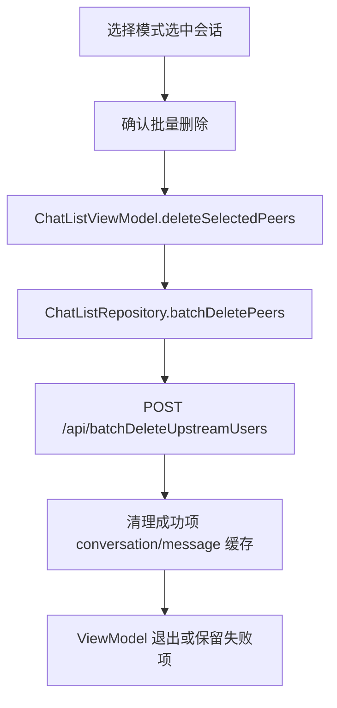

# 技术设计: Android 会话列表批量删除

## 技术方案
### 核心技术
- Kotlin、Jetpack Compose、ViewModel、Retrofit、Room、MockK/JUnit。

### 实现要点
- `ChatApiService` 增加 `batchDeleteUpstreamUsers(@Body payload)`。
- `NetworkModels.kt` 增加批量删除响应 DTO，解析 `successCount`、`failCount`、`failedItems`。
- `ConversationDao` 增加 `deleteByIds(ids: List<String>)`；复用 `MessageDao.clearByPeer` 循环清理消息缓存。
- `ChatListRepository.batchDeletePeers(peerIds)` 负责读当前身份、去空去重、调用远端、计算成功/失败 ID、清理成功项缓存。
- `ChatListViewModel` 增加选择模式状态、选中集合、批量删除确认、成功/部分失败消息。
- `ChatListScreenContent` 增加批量管理入口、选择模式底部操作区、会话项选择按钮和确认弹窗。

## 设计边界
- **范围内:** Android 会话列表批量删除闭环。
- **范围外:** 服务端批量删除实现、Vue 端调整、日期分组批量删除。
- **模块职责:** 网络层声明 API 与 DTO；Repository 处理远端和本地缓存一致性；ViewModel 管理选择状态；Compose 渲染选择模式和确认。
- **接口契约:** `POST /api/batchDeleteUpstreamUsers` 请求 JSON `{ myUserId: String, userToIds: String[] }`；响应 `data.failedItems[].userToId` 表示失败项。
- **数据边界:** 不新增持久化字段；仅删除已有本地缓存行。
- **依赖边界:** 不新增依赖，不升级 Gradle 或 Android 依赖。
- **大型项目最小改动:** 仅修改会话列表、网络模型/API、DAO 和对应测试，避免改动聊天页或服务端。

## 架构设计

## API设计
### POST /api/batchDeleteUpstreamUsers
- **请求:** `{ "myUserId": "当前身份ID", "userToIds": ["目标用户ID"] }`
- **响应:** `ApiEnvelope<BatchDeleteUsersResponseDto>`，其中 `failedItems` 包含失败目标 ID 和原因。

## 数据模型
无数据库 schema 变更。

## 安全与性能
- **安全:** 批量删除必须二次确认；空 ID 会被客户端去重过滤；失败项不清理本地缓存。
- **性能:** 单次请求最多按服务端契约发送 200 个 ID；本切片按当前可见选择集合一次提交，后续可扩展前端同款分批。

## 测试与部署
- **测试:** 补 Repository 成功/部分失败/缺失身份测试，ViewModel 选择模式和批量删除状态测试，Compose 回调和确认弹窗测试。
- **部署:** Android 客户端常规构建发布流程；本切片不涉及服务端部署。
