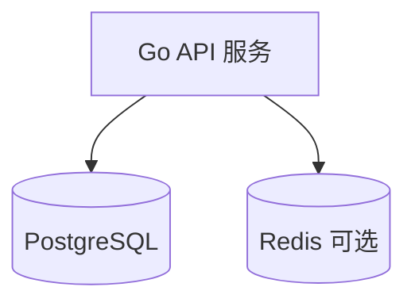

# 变更提案: db-migrate-postgres

## 元信息
```yaml
类型: 重构
方案类型: implementation
优先级: P1
状态: 草稿
创建: 2026-02-01
```

---

## 1. 需求

### 背景
目前后端数据库实现强绑定 MySQL：配置解析仅接受 `mysql://` / `jdbc:mysql://`，连接层固定 `sql.Open("mysql", ...)`，
并且大量 DDL/DML 使用 MySQL 方言（`AUTO_INCREMENT`、`INSERT IGNORE`、`ON DUPLICATE KEY UPDATE`、`CONVERT ... COLLATE`、`?` 占位符等）。

当需要把存储迁移到 PostgreSQL 时，现有实现会在启动建表/执行 SQL 时直接失败，因此需要系统性迁移。

### 目标
- 让 Go 后端可使用 PostgreSQL 作为主存储运行（启动可自动建表/迁移，核心 API 可用）。
- 清理 MySQL 方言依赖（驱动、SQL 语法、占位符、`LastInsertId` 等）。
- 同步更新运行说明与知识库文档（README/KB 以代码为准）。

### 约束条件
```yaml
时间约束: 无硬性要求（按迁移风险拆分里程碑）
性能约束: 迁移后核心查询/写入不应显著退化（需要基准/观测）
兼容性约束: 默认按“直接切换到 PostgreSQL”规划（不保证继续兼容 MySQL）
业务约束: 若已有线上 MySQL 数据，需要提供可重复执行的数据迁移与校验步骤（Runbook）
```

### 验收标准
- [ ] `DB_URL` 支持 PostgreSQL 连接串（建议：`postgres://` / `postgresql://` / `jdbc:postgresql://` 其一，方案中明确）
- [ ] 服务可在空 PostgreSQL 库上启动，并完成 `ensureSchema` 初始化/迁移
- [ ] 关键写入不依赖 `LastInsertId`（PostgreSQL 下不再使用）
- [ ] `go test ./...` 通过（含 SQL mock 相关测试更新）
- [ ] README/CLAUDE/知识库中数据库相关描述与代码保持一致

---

## 2. 方案

### 技术方案
推荐方案：**直接迁移为 PostgreSQL-only**（不再兼容 MySQL），并按现有 `database/sql` 直连方式改造：

1) **驱动与连接串**
- Go driver 采用 `pgx` 的 `database/sql` 适配层（`github.com/jackc/pgx/v5/stdlib`），保持现有 `*sql.DB` 注入方式不变。
- `DB_URL` 扩展为 PostgreSQL URL（并明确是否沿用现有的 `DB_USERNAME/DB_PASSWORD` 组装方式，或改为在 `DB_URL` 中包含凭证）。

2) **SQL 方言迁移（核心工作量）**
- 全量替换 `?` 占位符为 PostgreSQL 的 `$1/$2/...`。
- 替换 MySQL 特性：
  - `INSERT IGNORE` → `INSERT ... ON CONFLICT DO NOTHING`
  - `ON DUPLICATE KEY UPDATE` → `INSERT ... ON CONFLICT (...) DO UPDATE SET ...`（使用 `EXCLUDED`）
  - `CONVERT(... USING utf8mb4) COLLATE ...` → 去除/改写为 PG 可执行的 `UNION ALL` 选择（统一类型为 `text`）
  - `AUTO_INCREMENT` → `GENERATED BY DEFAULT AS IDENTITY` / `BIGSERIAL`
  - `INDEX ...`（表内索引声明）→ `CREATE INDEX IF NOT EXISTS ...`
- 替换 `LastInsertId` 使用点为 `INSERT ... RETURNING id`。

3) **Schema 初始化/迁移**
- 改造 `internal/app/schema.go`：用 PG 语法定义 DDL，并用 `IF NOT EXISTS` 做幂等迁移（替换 MySQL 错误码分支）。
- 保留“应用启动自动建表/迁移”的行为，避免引入额外迁移工具带来的新依赖与学习成本。

备选方案（不推荐）：同时支持 MySQL + PostgreSQL（需要方言分层/SQL 生成或引入 sqlx/gorm/sqlc 等，复杂度显著上升）。

### 影响范围
```yaml
涉及模块:
  - internal/config: DB_URL 解析与默认值/文档一致性
  - internal/app: openDB/ensureSchema/所有 SQL 语句（占位符、upsert、insert ignore、RETURNING 等）
  - sql/: 初始化脚本补齐 PostgreSQL 版本（可选但建议）
  - docs/README/CLAUDE + helloagents 知识库: 数据库描述、运行方式、注意事项
预计变更文件: 20~40（以 SQL 语句分布为准）
```

### 风险评估
| 风险 | 等级 | 应对 |
|------|------|------|
| SQL 方言差异导致运行时错误（占位符/upsert/索引创建） | 高 | 分模块迁移 + 单测/集成冒烟；先跑 `go test ./...` 再本地连 PG 启动 |
| `LastInsertId` 在 PG 不可用导致写入逻辑出错 | 高 | 全量搜索替换为 `RETURNING` 并补齐测试 |
| 时间/时区语义变化（DATETIME vs timestamp/timestamptz） | 中 | 明确列类型策略；连接/会话设置时区；新增排序/时间字段相关测试 |
| 线上数据迁移风险（类型/编码/唯一约束差异） | 高 | 提供 runbook（导出/导入/校验），并在上线前做全量校验与回滚预案 |

---

## 3. 技术设计（可选）

> 涉及架构变更、API设计、数据模型变更时填写

### 架构设计


### API设计
本次迁移目标为存储替换，不计划变更对外 HTTP API（如需变更会在任务清单中显式列出）。

### 数据模型
数据模型以现有 `internal/app/schema.go` 为准迁移到 PostgreSQL。重点差异：
- 自增主键：`AUTO_INCREMENT` → `GENERATED ... AS IDENTITY`
- 时间字段：`DATETIME` → `timestamp` 或 `timestamptz`（需决策）
- 索引：从“表内 INDEX”改为显式 `CREATE INDEX`

---

## 4. 核心场景

> 执行完成后同步到对应模块文档

### 场景: 服务在 PostgreSQL 上冷启动
**模块**: internal/app
**条件**: 目标库为空；设置 `DB_URL` 为 PostgreSQL 连接串
**行为**: 服务启动 → `openDB` 建立连接 → `ensureSchema` 建表/迁移 → HTTP 服务可用
**结果**: 启动过程无 schema/sql 错误；核心 API 可正常读写

---

## 5. 技术决策

> 本方案涉及的技术决策，归档后成为决策的唯一完整记录

### db-migrate-postgres#D001: 选择 PostgreSQL 驱动实现
**日期**: 2026-02-01
**状态**: ✅采纳
**背景**: 当前使用 `database/sql` + MySQL driver；迁移到 PG 需要选择稳定的 driver，并尽量减少侵入式改造。
**选项分析**:
| 选项 | 优点 | 缺点 |
|------|------|------|
| A: pgx + database/sql（`jackc/pgx/v5/stdlib`） | 活跃维护；性能与特性较好；兼容 `*sql.DB` | 需要引入新依赖；占位符必须为 `$n` |
| B: lib/pq | 生态熟悉 | 社区已不推荐；长期维护风险 |
**决策**: 选择方案 A
**理由**: 兼容现有注入方式且维护活跃，降低长期风险。
**影响**: `go.mod`、`internal/app/app.go`（驱动注册与 openDB）

### db-migrate-postgres#D002: 是否继续兼容 MySQL
**日期**: 2026-02-01
**状态**: ✅采纳
**背景**: 需求是“迁移到 PostgreSQL”，而代码中 MySQL 方言深度渗透（DDL/DML/占位符/错误码），双栈会显著增加复杂度与维护成本。
**选项分析**:
| 选项 | 优点 | 缺点 |
|------|------|------|
| A: PostgreSQL-only（直接切换） | 工作量更可控；代码更干净 | 迁移为 breaking change；回滚需要额外方案 |
| B: MySQL+PostgreSQL 双栈 | 可灰度/回滚更灵活 | 需要方言层/SQL 生成/更多测试；长期维护成本高 |
**决策**: 选择方案 A
**理由**: 符合“直接修改、不保留向后兼容”的项目原则，并显著降低复杂度。
**影响**: README/运行环境变量/知识库、以及所有 SQL 语句的方言切换策略

### db-migrate-postgres#D003: Schema 维护方式
**日期**: 2026-02-01
**状态**: ✅采纳
**背景**: 目前通过 `ensureSchema` 在启动时自动建表并做轻量迁移；迁移到 PG 后需要决定是否引入专用 migration 工具。
**选项分析**:
| 选项 | 优点 | 缺点 |
|------|------|------|
| A: 继续使用 `ensureSchema`（改为 PG DDL + IF NOT EXISTS） | 贴合现有行为；无需引入新工具 | 需要谨慎维护 DDL；复杂迁移能力有限 |
| B: 引入 `golang-migrate` 等工具 | 标准化迁移；复杂变更更安全 | 新依赖与使用成本；需要部署侧配合 |
**决策**: 选择方案 A
**理由**: 本次目标是“迁移可运行”，保持现有启动行为，降低改造范围；如后续迁移复杂度上升再评估方案 B。
**影响**: `internal/app/schema.go`、`sql/` 中的手工初始化脚本策略
