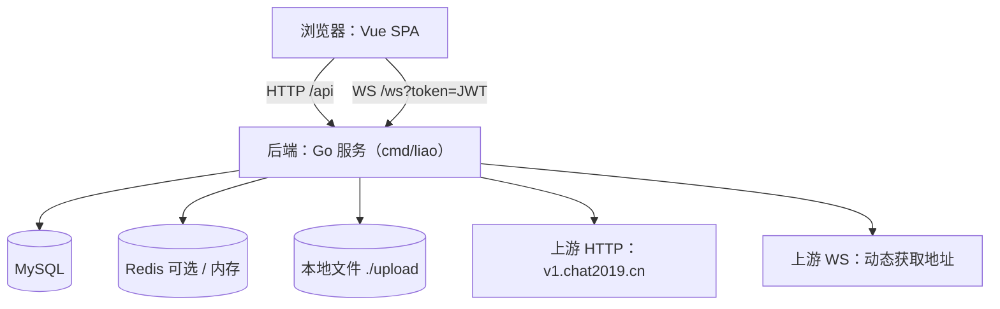
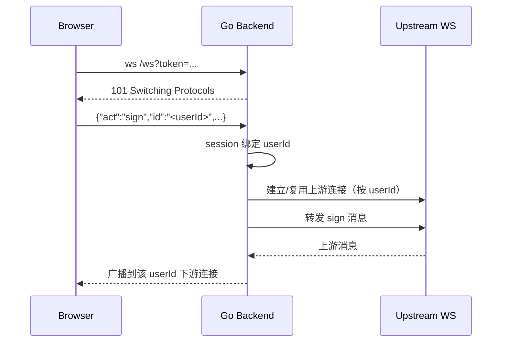

# 架构设计

## 总体架构

> 仓库仍保留历史 Java(Spring Boot) 实现（`src/main/java/`，已弃用仅供对照；详见 `src/README.md`）；当前运行形态以 Go 单进程后端为主（`cmd/liao` + `internal/app/`）。

## 技术栈
- **后端:** Go 1.22（chi、gorilla/websocket、JWT HS256）
- **前端:** Vue 3 / Vite / TypeScript
- **数据:** MySQL（必需）、Redis（可选；默认内存缓存）、本地文件系统（`./upload`）

## 代码结构

### 后端（Go）
- 入口：`cmd/liao/main.go`（日志初始化、加载配置、启动 HTTP Server、优雅关闭）
- 组装：`internal/app/app.go`（DB/缓存/WS/上传/路由组装）
- 路由：`internal/app/router.go`（HTTP `/api` + WS `/ws` + 静态资源与 SPA 回退）
- 鉴权：`internal/app/jwt.go`、`internal/app/middleware.go`、`internal/app/auth_handlers.go`
- WS 代理：`internal/app/websocket_proxy.go`、`internal/app/websocket_manager.go`、`internal/app/forceout.go`
- 媒体：`internal/app/media_upload.go`、`internal/app/media_history_handlers.go`、`internal/app/media_repair*.go`、`internal/app/file_storage.go`
- 身份/收藏：`internal/app/identity*.go`、`internal/app/favorite*.go`
- 静态托管：`internal/app/static.go`（SPA 回退；`/upload/**` 映射到本地 `./upload`）
- 配置：`internal/config/config.go`（以环境变量为主，变量名/默认值对齐 `application.yml`）

### 前端（Vue）
- 入口：`frontend/src/main.ts`、`frontend/src/App.vue`
- 路由/页面：`frontend/src/router/*`、`frontend/src/views/*`
- 业务逻辑：`frontend/src/composables/*`、`frontend/src/stores/*`
- 组件：`frontend/src/components/*`（chat/identity/media/settings 等）

## 配置与运行时

> 所有敏感信息仅通过环境变量注入，禁止写入仓库文档与代码默认值之外的真实凭据。

常用环境变量（非穷举）：
- 数据库：`DB_URL`、`DB_USERNAME`、`DB_PASSWORD`
- 鉴权：`AUTH_ACCESS_CODE`、`JWT_SECRET`、`TOKEN_EXPIRE_HOURS`
- WS 上游降级：`WEBSOCKET_UPSTREAM_URL`
- 缓存：`CACHE_TYPE`（memory/redis）、`REDIS_HOST`、`REDIS_PORT`、`REDIS_PASSWORD`、`REDIS_DB`
- 图片服务：`IMG_SERVER_HOST`、`IMG_SERVER_PORT`、`IMG_SERVER_UPSTREAM_URL`
- 日志：`LOG_LEVEL`（debug/info/warn/error）、`LOG_FORMAT`（json/text）

## 核心流程

### WebSocket 代理（/ws）

### HTTP 代理与本地增强（/api）
- 认证：`/api/auth/login` 换取 JWT；除登录/verify 外其余 `/api/**` 需 Bearer Token（详见 `api.md`）。
- 代理：对上游 HTTP 接口进行透传调用，并在本地执行缓存写入/列表增强（用户信息、最后消息等）。
- 媒体：上传落盘到 `./upload` 并维护本地表与缓存（详见 `data.md`）。
- 媒体查重：`/api/checkDuplicateMedia` 支持上传文件后按 `image_hash` 表进行 MD5 精确查重与 pHash 相似度查询（仅图片可计算 pHash）。
- 静态资源：后端托管前端 SPA 静态资源并提供路由回退。

## 重大架构决策

完整 ADR 存储在各变更的 `history/**/how.md` 中，本章节提供索引。

| adr_id | title | date | status | affected_modules | details |
|--------|-------|------|--------|------------------|---------|
| ADR-001 | 采用 Go 单进程后端完全替换（推荐） | 2026-01-07 | ✅已采纳 | Backend | [链接](../history/2026-01/202601071248_go_backend_rewrite/how.md#adr-001-采用-go-单进程后端完全替换推荐) |
