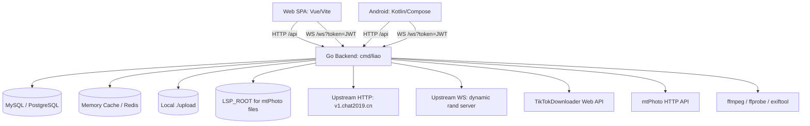
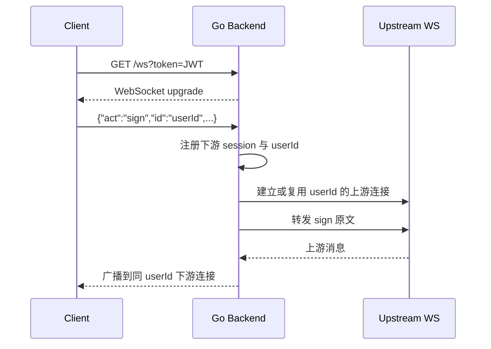
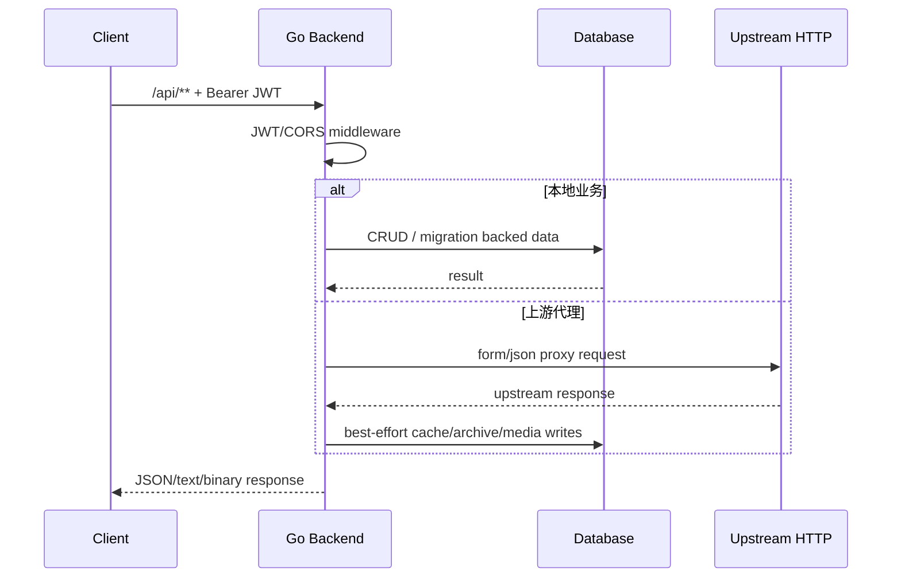

# 架构设计

## 总体架构

```mermaid
flowchart TD
  Web[Web SPA: Vue/Vite] -->|HTTP /api| Go[Go Backend: cmd/liao]
  Web -->|WS /ws?token=JWT| Go
  Android[Android: Kotlin/Compose] -->|HTTP /api| Go
  Android -->|WS /ws?token=JWT| Go
  Go --> DB[(MySQL / PostgreSQL)]
  Go --> Cache[(Memory Cache / Redis)]
  Go --> Upload[(Local ./upload)]
  Go --> Lsp[(LSP_ROOT for mtPhoto files)]
  Go --> UpHTTP[Upstream HTTP: v1.chat2019.cn]
  Go --> UpWS[Upstream WS: dynamic rand server]
  Go --> TD[TikTokDownloader Web API]
  Go --> MT[mtPhoto HTTP API]
  Go --> Tools[ffmpeg / ffprobe / exiftool]
```

## 技术栈
- **后端:** Go 1.25.6，chi，gorilla/websocket，JWT HS256，MySQL/PostgreSQL 双方言，Redis 可选。
- **Web 前端:** Vue 3，Vite，TypeScript，Pinia，Vue Router，Axios，Tailwind CSS，Vitest。
- **Android:** Kotlin，Jetpack Compose，Retrofit/OkHttp，Room，DataStore，Hilt。
- **数据与文件:** `sql/{mysql,postgres}/*.sql` 版本迁移，`./upload` 本地媒体目录，`LSP_ROOT` 映射 mtPhoto 本地文件。

## 代码结构
- `cmd/liao/`: Go 服务入口、日志、HTTP Server 与优雅关闭。
- `internal/config/`: 环境变量加载、DB URL 解析和配置校验。
- `internal/database/`: DB 方言、SQL rebind、CRUD helper、迁移执行器。
- `internal/app/`: HTTP 路由、服务组装、认证、WS、媒体、抖音、mtPhoto、视频抽帧、系统配置。
- `frontend/src/`: Web 客户端 API、stores、composables、components、views 和测试。
- `android-app/`: Android 客户端工程。
- `sql/`: MySQL/PostgreSQL 迁移脚本。

## 核心流程

### WebSocket 代理

```mermaid
sequenceDiagram
  participant C as Client
  participant B as Go Backend
  participant U as Upstream WS
  C->>B: GET /ws?token=JWT
  B-->>C: WebSocket upgrade
  C->>B: {"act":"sign","id":"userId",...}
  B->>B: 注册下游 session 与 userId
  B->>U: 建立或复用 userId 的上游连接
  B->>U: 转发 sign 原文
  U-->>B: 上游消息
  B-->>C: 广播到同 userId 下游连接
```

### HTTP API

```mermaid
sequenceDiagram
  participant C as Client
  participant B as Go Backend
  participant DB as Database
  participant UP as Upstream HTTP
  C->>B: /api/** + Bearer JWT
  B->>B: JWT/CORS middleware
  alt 本地业务
    B->>DB: CRUD / migration backed data
    DB-->>B: result
  else 上游代理
    B->>UP: form/json proxy request
    UP-->>B: upstream response
    B->>DB: best-effort cache/archive/media writes
  end
  B-->>C: JSON/text/binary response
```

## 运行与部署
- 开发后端：`go run ./cmd/liao`，默认监听 `:8080`。
- 开发 Web：`cd frontend && npm run dev`，Vite 默认监听 `:3000` 并代理 `/api`、`/ws` 到 `:8080`。
- Docker：多阶段构建前端静态资源和 Go 二进制，最终 Alpine 镜像包含 `ffmpeg`、`exiftool`、SQL 脚本和静态资源。
- 数据库迁移：应用启动时由 `internal/app/schema.go` 调用 `internal/database/migrator.go`，按文件名顺序执行 `sql/{dialect}/*.sql`。

## 重大架构决策

| adr_id | title | date | status | affected_modules | details |
|--------|-------|------|--------|------------------|---------|
| ADR-001 | 采用 Go 单进程后端替换历史服务 | 2026-01-07 | 已采纳 | Backend/API/WS | [链接](../history/2026-01/202601071248_go_backend_rewrite/how.md#adr-001-采用-go-单进程后端完全替换推荐) |
| ADR-002 | 数据库通过 `DB_URL` scheme 选择 MySQL/PostgreSQL | 2026-05-07 | 已采纳 | Database | 当前代码事实：`internal/config.ParseJDBCURL` + `internal/database.DialectFromScheme` |
| ADR-20260524-01 | 以临时会话接入替代跨身份复用连接 | 2026-05-24 | 已采纳 | Chat UI/WS | [链接](../history/2026-05/202605241257_cross_identity_contact_handoff/how.md#adr-20260524-01-以临时会话接入替代跨身份复用连接) |
| ADR-20260524-02 | 复用 `chat_user_archive` 而非新增联系人池表 | 2026-05-24 | 已采纳 | User History/Database | [链接](../history/2026-05/202605241257_cross_identity_contact_handoff/how.md#adr-20260524-02-复用-chat_user_archive-而非新增联系人池表) |
| ADR-20260524-03 | Message Store 使用身份隔离 key | 2026-05-24 | 已采纳 | Chat UI | [链接](../history/2026-05/202605241257_cross_identity_contact_handoff/how.md#adr-20260524-03-message-store-使用身份隔离-key) |
